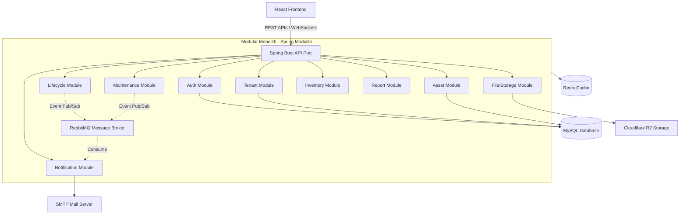

# ITAM - IT Asset Management System
*(Hệ thống Quản lý Tài sản Công nghệ Thông tin)*

Hệ thống quản lý thông tin về tài sản CNTT (phần cứng & phần mềm) và các hoạt động quản lý vòng đời cấp phát tài sản cho nhân viên trong môi trường doanh nghiệp quy mô lớn (hỗ trợ mô hình đa đơn vị/đa phòng ban - Multi-tenant).

---

## 📖 Mục lục
- [Giới thiệu dự án](#-giới-thiệu-dự-án)
- [Các chức năng chính](#-các-chức-năng-chính)
- [Kiến trúc hệ thống](#-kiến-trúc-hệ-thống)
- [Công nghệ sử dụng](#-công-nghệ-sử-dụng)
- [Hướng dẫn thiết lập và Chạy dự án](#-hướng-dẫn-thiết-lập-và-chạy-dự-án)
  - [Yêu cầu hệ thống](#yêu-cầu-hệ-thống)
  - [Cấu hình & Chạy Backend](#cấu-hình--chạy-backend)
  - [Cấu hình & Chạy Frontend](#cấu-hình--chạy-frontend)
- [Tài khoản kiểm thử mặc định](#-tài-khoản-kiểm-thử-mặc-định)

---

## 🌟 Giới thiệu dự án

**ITAM** được thiết kế để giải quyết bài toán quản lý tài sản công nghệ thông tin phức tạp trong doanh nghiệp. Hệ thống không chỉ theo dõi số lượng thiết bị trong kho mà còn quản lý chi tiết toàn bộ vòng đời của một tài sản từ khi mua sắm, nhập kho, cấp phát cho nhân viên sử dụng, bảo trì/sửa chữa định kỳ cho đến khi thanh lý.

Với thiết kế hỗ trợ **Multi-tenant**, mỗi đơn vị thành viên hoặc phòng ban trong tổng công ty có thể vận hành độc lập, tự quản lý nhân sự và tài sản của mình dưới sự giám sát vĩ mô của Quản trị viên tối cao (Super Admin).

---

## 🛠 Các chức năng chính

### 1. Chức năng Core
*   **Đăng nhập & Phân quyền**: Xác thực tài khoản, hỗ trợ phân quyền chặt chẽ theo 4 phân nhóm Role chính:
    *   `Super Admin` (Quản trị tối cao toàn hệ thống)
    *   `Admin` (Quản trị viên của một đơn vị/tenant)
    *   `Staff` (Kỹ thuật viên IT vận hành trực tiếp)
    *   `User` (Nhân viên sử dụng thiết bị)
*   **Quản lý tài sản (Asset Management)**:
    *   **Phần cứng (Hardware)**: Theo dõi thông tin chi tiết, Số Serial, hãng sản xuất, nhà cung cấp, tình trạng vật lý.
    *   **Phần mềm (Software/License)**: Theo dõi License Key, tổng số lượt cài đặt cho phép (Seats), số lượng đã dùng, ngày hết hạn.
    *   Hỗ trợ tìm kiếm thông minh, bộ lọc động và xóa mềm (Soft Delete).
*   **Vòng đời cấp phát (Lifecycle)**:
    *   Bàn giao thiết bị cho nhân viên.
    *   Thu hồi thiết bị về kho.
    *   Điều chuyển tài sản giữa các nhân viên trong nội bộ đơn vị hoặc điều chuyển liên đơn vị.
    *   Lưu trữ lịch sử biến động tài sản tự động.
*   **Quản lý Bảo trì & Sửa chữa (Maintenance)**:
    *   Thiết lập kế hoạch bảo trì định kỳ cho các thiết bị.
    *   Theo dõi thời hạn bảo hành của tài sản phần cứng/phần mềm.
    *   Ghi nhật ký lịch sử sửa chữa vật lý và chi phí tương ứng.
*   **Kiểm kê tài sản (Inventory)**:
    *   Khởi tạo đợt kiểm kê tài sản định kỳ cho các đơn vị.
    *   Đánh dấu trạng thái kiểm kê thực tế: *Tồn kho, Thất lạc, Hỏng*.
    *   Tự động xuất báo cáo chênh lệch sau kiểm kê.
*   **Dashboard & Báo cáo**:
    *   Biểu đồ thống kê trực quan số lượng tài sản theo tình trạng, phòng ban.
    *   Xuất báo cáo tồn kho, báo cáo cấp phát, báo cáo bảo trì (dạng Excel/PDF).

### 2. Chức năng Nâng cao
*   **QR Code**: Tự động sinh mã QR Code duy nhất cho mỗi tài sản khi tạo mới. Hỗ trợ quét mã QR bằng camera để xem nhanh thông tin chi tiết của thiết bị.
*   **Real-time & Notification**:
    *   Thông báo qua Email: Cảnh báo sắp hết hạn bảo hành, nhắc nhở lịch kiểm kê tài sản.
    *   Thông báo thời gian thực trên web bằng **WebSocket (STOMP)**.
*   **Quản lý tài liệu (Document Upload)**: Cho phép đính kèm hóa đơn mua hàng, biên bản giao nhận tài sản lên Cloud Storage.
*   **Audit Log (Nhật ký thao tác)**: Ghi lại chi tiết hành động của người dùng (ai thực hiện, chỉnh sửa dữ liệu gì, vào thời điểm nào) phục vụ mục đích bảo mật và giám sát hệ thống.

---

## 🏗 Kiến trúc hệ thống

Dự án được xây dựng theo kiến trúc **Modular Monolith** sử dụng **Spring Modulith** ở phía Backend. Cấu trúc này giúp chia nhỏ ứng dụng thành các module độc lập về mặt logic nghiệp vụ nhưng vẫn chạy chung trên một tiến trình triển khai duy nhất:



*   **Tính độc lập**: Mỗi module (như `asset`, `tenant`, `auth`, `lifecycle`...) chịu trách nhiệm cho các domain nghiệp vụ riêng biệt và được thiết kế đóng gói trong các package tương ứng.
*   **Giao tiếp bất đồng bộ (Event-Driven)**: Các module giao tiếp với nhau qua các Event nội bộ hoặc qua RabbitMQ để tránh việc gọi trực tiếp (tight coupling) giữa các Service của các module khác nhau.

---

## 💻 Công nghệ sử dụng

### Backend Stack
*   **Core Framework**: Spring Boot 3.4.0 (Java 21)
*   **Database & ORM**: MySQL 8.0, Spring Data JPA (Hibernate)
*   **Modular Architecture**: Spring Modulith
*   **Security**: Spring Security & JSON Web Token (JWT)
*   **Caching**: Redis (Lettuce client)
*   **Message Broker**: RabbitMQ (AMQP)
*   **Cloud Storage**: Cloudflare R2 (tương thích AWS S3 API) thông qua AWS SDK v2
*   **API Docs**: Springdoc OpenAPI (Swagger UI)
*   **Báo cáo**: Apache POI (Excel), OpenPDF (PDF)
*   **Mã vạch & QR Code**: Google ZXing
*   **Công cụ phụ trợ**: MapStruct (Mapping DTO/Entity), Lombok (Boilerplate code reduction)

### Frontend Stack
*   **Build Tool**: Vite
*   **Language**: TypeScript
*   **Library**: React 19
*   **UI Framework**: Ant Design (Antd)
*   **CSS Framework**: TailwindCSS v4
*   **State Management**: MobX & MobX React Lite (Quản lý state dạng reactive)
*   **Routing**: React Router DOM v7
*   **API Client Generation**: Orval (Tự động tạo các hooks/API calls và Typescript Interfaces từ file Swagger/OpenAPI của Backend)
*   **Real-time Communication**: `@stomp/stompjs` & `sockjs-client` (WebSocket STOMP client)
*   **Charts**: Recharts (Vẽ biểu đồ phân tích dữ liệu)

---

## 🚀 Hướng dẫn thiết lập và Chạy dự án

### Yêu cầu hệ thống
Để chạy dự án local, máy tính của bạn cần cài đặt:
- **Java Development Kit (JDK) 21**
- **Node.js** (Phiên bản v18 trở lên) & **npm**
- **MySQL Server 8.0+**
- **Redis Server 6.0+**
- **RabbitMQ Server 3.0+**

---

### Cấu hình & Chạy Backend

#### Bước 1: Khởi tạo Cơ sở dữ liệu
1. Mở MySQL client và tạo một cơ sở dữ liệu mới tên là `itam_db`:
   ```sql
   CREATE DATABASE itam_db CHARACTER SET utf8mb4 COLLATE utf8mb4_unicode_ci;
   ```
2. Import script khởi tạo cấu trúc và dữ liệu phân quyền ban đầu:
   Chạy file SQL tại đường dẫn: `backend/src/main/resources/sql/init.sql` vào cơ sở dữ liệu `itam_db` vừa tạo. File này chứa các script tạo bảng (nếu không dùng hibernate auto-update) và dữ liệu chèn sẵn về Quyền (Permissions), Vai trò (Roles) và tài khoản Super Admin mặc định.

#### Bước 2: Cấu hình Môi trường
Cập nhật thông tin kết nối dịch vụ (MySQL, Redis, RabbitMQ, Cloudflare R2, Email) trong file:
[application-local.yml](file:///g:/documents/viettel_digital_talent/practice/practice_pharse_1/source_code/backend/src/main/resources/application-local.yml)

Các trường cần lưu ý cấu hình:
- `spring.datasource.username` và `spring.datasource.password`: Tài khoản MySQL của bạn.
- `spring.data.redis.host`, `port`, `password`: Kết nối tới Redis local.
- `spring.rabbitmq.host`, `port`, `username`, `password`: Kết nối tới RabbitMQ local.
- `spring.mail.username` và `password`: Tài khoản email SMTP gửi thông báo (ví dụ Gmail App Password).
- `app.r2`: Endpoint, keys của Cloudflare R2/S3 (nếu muốn chạy tính năng upload biên bản bàn giao/hóa đơn).

#### Bước 3: Build & Chạy Spring Boot
Tại thư mục gốc của Backend (`/backend`), chạy các lệnh sau:

*   **Trên Windows (Sử dụng PowerShell/CMD)**:
    ```bash
    ./gradlew.bat bootRun
    ```
*   **Trên Linux/macOS**:
    ```bash
    chmod +x gradlew
    ./gradlew bootRun
    ```

Khi ứng dụng khởi chạy thành công, bạn có thể kiểm tra tài liệu API thông qua Swagger UI:
👉 **Swagger UI**: [http://localhost:8080/swagger-ui.html](http://localhost:8080/swagger-ui.html)  
👉 **API JSON Docs**: [http://localhost:8080/v3/api-docs](http://localhost:8080/v3/api-docs)

---

### Cấu hình & Chạy Frontend

#### Bước 1: Cài đặt Dependencies
Di chuyển vào thư mục `/frontend` và tiến hành cài đặt các gói thư viện:
```bash
cd frontend
npm install
```

#### Bước 2: Tạo API Client tự động (Orval)
Dự án frontend sử dụng thư viện **Orval** để đồng bộ tự động API từ backend.
1. Đảm bảo rằng **Backend đang chạy** tại cổng `8080`.
2. Chạy lệnh sau để Orval đọc cấu trúc `/v3/api-docs` của backend và tự sinh code Axios client:
   ```bash
   npm run api:gen
   ```
Code API tự sinh sẽ được lưu trữ trong thư mục `/frontend/src/api-generated`.

#### Bước 3: Chạy ứng dụng ở chế độ Phát triển
Khởi chạy Vite dev server:
```bash
npm run dev
```
Mặc định ứng dụng sẽ chạy tại địa chỉ:
👉 **Frontend App**: [http://localhost:5173](http://localhost:5173)

---

## 🔑 Tài khoản kiểm thử mặc định

Sau khi import thành công file `init.sql`, hệ thống sẽ có sẵn tài khoản Quản trị tối cao (Super Admin) để bạn đăng nhập thử nghiệm:

- **Tài khoản**: `admin`
- **Mật khẩu**: `admin@123`

*Lưu ý: Đối với tài khoản Admin đơn vị, Staff và User thông thường, bạn có thể đăng nhập bằng tài khoản Super Admin ở trên để tự tạo các Đơn vị (Tenant), Phòng ban và gán tài khoản cho người dùng kiểm thử.*

---
Chúc bạn thiết lập và trải nghiệm dự án thành công! Nếu gặp bất kỳ khó khăn nào trong quá trình cài đặt, vui lòng tạo Issue hoặc liên hệ nhóm phát triển.
