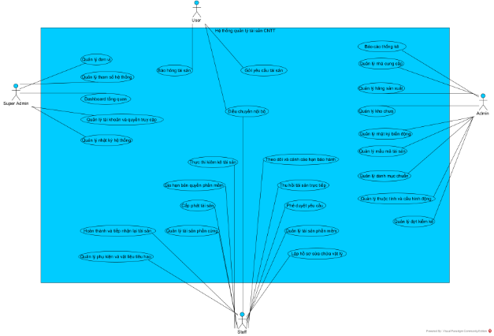
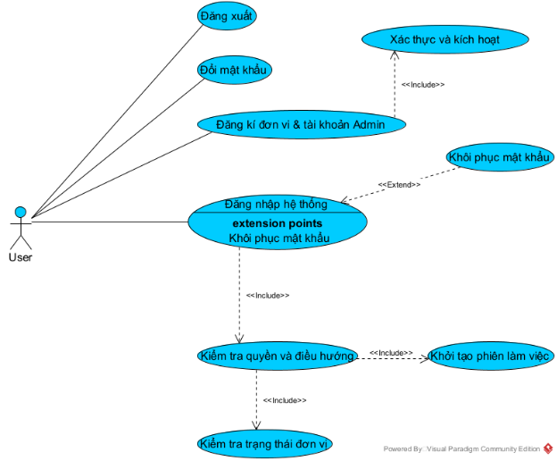
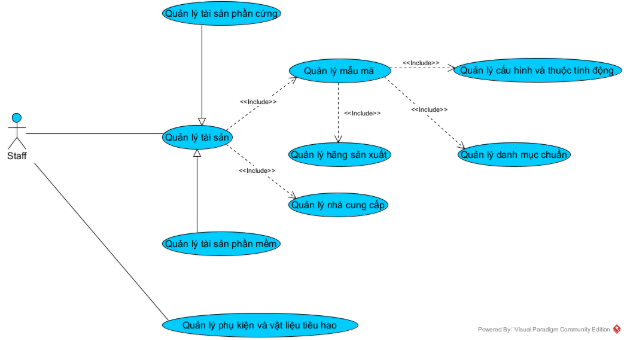
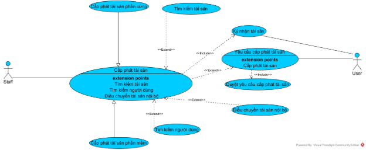
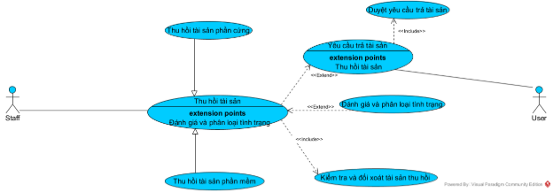
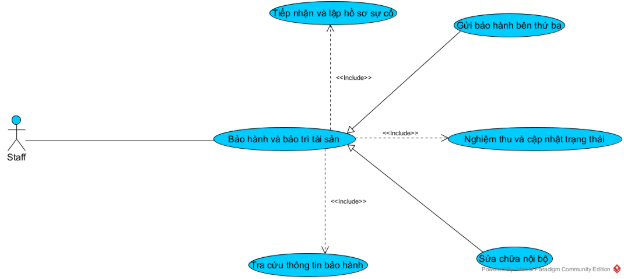
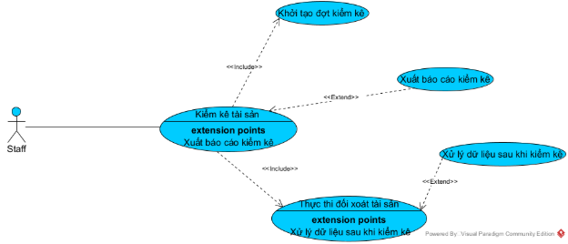
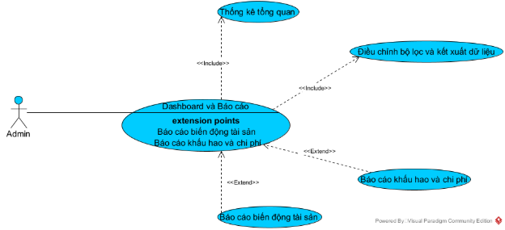
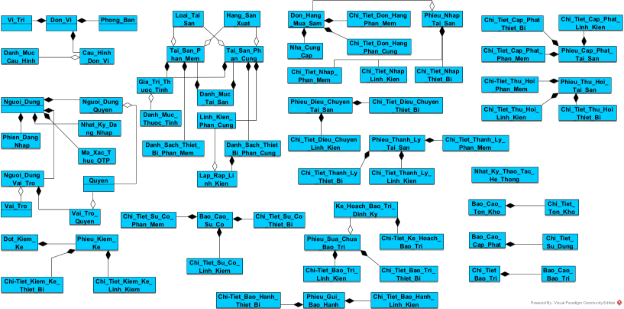

**MỤC LỤC**

1. Pha lấy yêu cầu
1. Xây dựng mô hình nghiệp vụ bằng ngôn ngữ tự nhiên
1. Mục đích và phạm vi của hệ thống
- Mục đích: Hệ thống web site, cho phép quản lý thông tin về tài sản CNTT, và hoạt động quản lý vòng đời cập phát tải sản cho nhân viên sử dụng.
- Phạm vi của hệ thống: Ứng dụng Website, chạy trên môi trường internet trong môi trường doanh nghiệp (có nhiều đơn vị phòng ban nhỏ bên trong).
- Phạm vi người dùng:
- Quản trị viện toàn hệ thống
- Quản trị viên tại 1 đơn vị
- Kĩ thuật viên IT trong 1 đơn vị
- Nhân viên trực tiếp sử dụng tài sản
- Phạm vi chức năng:
  1. Các chức năng core:
+ Đăng nhập hệ thống
- Đăng nhập, đăng xuất
- Phân quyền theo role
+ Quản lý tài sản
- Tạo mới tài sản
- Cập nhật thông tin
- Xóa mềm (soft delete)
- Tìm kiếm, lọc, phân trang
- Xem chi tiết tài sản
+ Cấp phát tài sản
- Bàn giao tài sản cho nhân viên
- Thu hồi tài sản
- Chuyển giao tài sản giữa các nhân viên
- Lưu lịch sử cấp phát
+ Quản lý bảo hành và bào trì
- Theo dõi hạn bảo hành
- Gửi cảnh báo sắp hết hạn
- Lịch sử sửa chữa / bào trì
+ Kiểm kê tài sản
- Tạo đợt kiểm kê
- Đánh dấu: tồn kho / thất lạc / hỏng.
- Xuất báo cáo chênh lệch
+ Dashboard
- Tổng số tài sản
- Kiểm kê theo trạng thái
- Kiểm kê theo phòng ban
- Kiểm kê theo thời gian bảo hàng
+ Báo cáo
- Báo cáo tài sản tồn kho
- Báo cáo tài sản đã cấp phát
- Báo cáo bảo trì
  1. Các chức năng nâng cao:
+ QR Code
- Sinh QR cho tài sản
- Scan để xem thông tin
+ Notification
- Email thông báo hết bảo hành
- Email nhắc kiểm kê
+ Upload file
- Hóa đơn mua hàng
- Biên bản bàn giao
+ Audit log
- Ai sửa gì
- Thời gian nào
+ Export
- Excel / PDF
+ Dark mode
+ Multi-language
1. Đối tượng sử dụng hệ thống và các chức năng được phép sử dụng
   1. Super Admin: Quản trị viện toàn hệ thống
+ Quản lý đơn vị
+ Quản lý cấu hình dùng chung cho toàn bộ hệ thống
+ Điều chuyển liên đơn vị
+ Giám sát hoạt động của hệ thống
  1. Admin: Quản trị viên tại 1 đơn vị
+ Đăng kí đơn vị
+ Quản lý nhân sự nội bộ
+ Quản lý cấu hình nội bộ đơn vị
+ Kiểm kê & Báo cáo
+ Phê duyệt yêu cầu
  1. Staff: Kĩ thuật viên IT trong 1 đơn vị
+ Quản lý tài sản
+ Vận hành vòng đời tại sản
+ Bảo hành & bảo trì
+ Thực thi kiểm kê
  1. User: Nhân viên trực tiếp sử dụng tài sản
+ Quản lý tài sản cá nhân
+ Yêu cầu cấp tài sản
+ Cá nhân hóa
1. Hoạt động tổng quát của các chức năng
   1. Đăng nhập và Phân quyền (Áp dụng cho toàn bộ các cấp độ người dùng):
+ Trên giao diện đăng nhập của hệ thống, người dùng thực hiện nhập thông tin đăng nhập (username/email + password), sau đó nhấn nút đăng nhập.
+ Lúc này hệ thống thực hiện kiểm tra:
- Trường hợp nhập thiếu thông tin: Nếu một trong hai ô Email hoặc Mật khẩu bị bỏ trống → Hệ thống hiển thị thông báo "Vui lòng nhập đầy đủ thông tin" → Quay lại bước người dùng nhập thông tin.
- Trường hợp sai thông tin xác thực: Nếu Email không tồn tại hoặc Mật khẩu không chính xác → Hệ thống hiển thị thông báo "Email hoặc mật khẩu không đúng" → Quay lại bước người dùng nhập thông tin.
- Trường hợp tài khoản bị khóa: Nếu tài khoản cá nhân hoặc Đơn vị (Tenant) gắn liền với tài khoản đó đang bị đình chỉ → Hệ thống hiển thị thông báo "Tài khoản của bạn đã bị khóa, vui lòng liên hệ Super Admin" → Quay lại bước người dùng nhập thông tin.
- Trường hợp Đơn vị chưa được phê duyệt: Nếu là tài khoản Admin đơn vị vừa tự đăng ký nhưng Super Admin chưa duyệt → Hệ thống hiển thị thông báo "Đơn vị đang chờ phê duyệt" → Quay lại bước người dùng nhập thông tin.
- Trường hợp thông tin hợp lệ: Hệ thống xác định Vai trò (Role) và Đơn vị (Tenant) của người dùng → Next.
+ Hệ thống thực hiện phân quyền và điều hướng người dùng vào giao diện vào giao diện tương ứng:
- Nếu người dùng là Super Admin:  chuyển hướng đến giao diện giao diện quản trị tối cao.
- Nếu người dùng là Admin của đơn vị: chuyển hướng đến giao diện nội bộ của đơn vị.
- Nếu người dùng là Staff của một đơn vị: chuyển hướng đên giao diện vẫn hành tài sản của một đơn vị.
- Nếu người dùng là User: chuyển hướng đến giao diện cá nhân.
+ Sau khi điều hướng thành công, hệ thống hiển thị thông tin người dùng và tùy chọn đăng xuất trên góc màn hình.
- Nếu người dùng muốn thoát khỏi hệ thống → Click nút Đăng xuất → Hệ thống hủy phiên làm việc và quay lại giao diện đăng nhập ban đầu.
  1. Quản lý tài sản (Áp dụng cho Admin và Staff):
+ Trong giao diện ứng dụng, người dùng chọn chức năng Quản lý tài sản. Hệ thống tiến hành kiểm tra vai trò (Role) và đơn vị (Tenant) của tài khoản để hiển thị phạm vi dữ liệu phù hợp:
- Nếu người dùng là User (Nhân viên thông thường): Hệ thống chỉ hiển thị danh sách các tài sản (Hardware/Software) hiện đang được cấp phát trực tiếp cho cá nhân đó.
- Nếu người dùng là Staff (Nhân viên IT) hoặc Admin Đơn vị: Hệ thống hiển thị toàn bộ danh sách tài sản chi tiết thuộc Đơn vị của mình (bao gồm tài sản trong kho, tài sản đang cấp phát, đang bảo trì hoặc đã thanh lý).
- Nếu người dùng là Super Admin (Bên thứ ba quản lý hệ thống): Hệ thống không hiển thị danh sách chi tiết hay thông tin định danh (như số Serial, người đang giữ) của từng thiết bị, mà chỉ hiển thị bảng thống kê số lượng tổng hợp và tổng giá trị tài sản của các Đơn vị trên toàn hệ thống để bảo mật nội bộ.
+ Hoạt động xem chi tiết tài sản (Áp dụng cho User, Staff, Admin của đơn vị):
- Người dùng click chọn một tài sản trong danh sách hiển thị. Giao diện chi tiết tài sản hiện lên:
- Nếu là tài sản phần cứng (Hardware): Hiển thị thông tin chung, số Serial, tình trạng vật lý, phòng ban (Unit) lưu trữ và lịch sử sửa chữa/bảo trì vật lý.
- Nếu là tài sản phần mềm (Software): Hiển thị thông tin chung, License Key, số lượng lượt cài đặt (Total/Used Seats) và ngày hết hạn bản quyền.
+ Hoạt động nhập mới tài sản (Chỉ áp dụng cho Staff và Admin của đơn vị):
- Người dùng click nút Thêm mới tài sản. Giao diện nhập liệu hiện lên yêu cầu chọn Loại tài sản (Hardware/Software), Mẫu mã (Model), Nhà sản xuất, Nhà cung cấp và nhập thông tin cấu hình đặc thù.
- Người dùng nhập thông tin và click nút Lưu:
- Nếu các thông tin bắt buộc (như số Serial đối với phần cứng hoặc License Key đối với phần mềm) bị bỏ trống → Hệ thống hiển thị thông báo lỗi yêu cầu nhập đủ thông tin → Quay lại bước nhập liệu.
- Nếu Số Serial hoặc License Key nhập vào đã tồn tại trên hệ thống → Hệ thống hiển thị thông báo trùng lặp → Quay lại bước nhập liệu.
- Nếu thông tin hoàn toàn hợp lệ → Hệ thống báo thêm mới thành công, tự động cấp mã Mã tài sản (Asset Tag), sinh mã QR Code định danh duy nhất và lưu trạng thái ban đầu là "Sẵn sàng cấp phát".
+ Hoạt động cập nhật thông tin và trạng thái của tài sản (Áp dụng cho Staff và Admin của đơn vị):
- Tại giao diện chi tiết tài sản, người dùng thay đổi các thuộc tính kỹ thuật động hoặc chuyển đổi trạng thái của tài sản (ví dụ: chuyển sang Bảo trì hoặc Báo hỏng) và click nút Cập nhật.
- Hệ thống tiến hành kiểm tra ràng buộc logic:
- Nếu tài sản đang ở trạng thái "Đang cấp phát" mà người dùng cố tình chuyển sang trạng thái "Thanh lý" hoặc thực hiện lệnh "Xóa" → Hệ thống từ chối thực hiện, hiển thị thông báo lỗi "Tài sản đang được nhân viên sử dụng, không thể thanh lý hoặc xóa" → Quay lại giao diện chi tiết.
- Nếu trạng thái hợp lệ → Hệ thống báo cập nhật thành công, đồng thời tự động ghi nhận một dòng nhật ký mới vào bảng Lịch sử biến động tài sản (lưu rõ: Ai sửa, sửa thông tin gì, vào lúc nào).
+ Hoạt động tìm kiếm và bộ lọc tài sản (Áp dụng cho toàn bộ các cấp người dùng của hệ thống).
- Người dùng nhập từ khóa cần tìm (Tên tài sản, Mã Asset Tag, Số Serial) vào ô tìm kiếm hoặc tích chọn các tiêu chí lọc (Theo hãng sản xuất, theo nhà cung cấp, theo tình trạng thiết bị) và nhấn nút Tìm kiếm. Lúc này:
- Nếu không có kết quả phù hợp trong database thuộc phạm vi được quyền xem → Hệ thống hiển thị thông báo "Không tìm thấy tài sản phù hợp" → Quay lại bước nhập từ khóa.
- Nếu có kết quả phù hợp → Hệ thống trả về danh sách tài sản tương ứng đã được lọc sạch theo đúng quy định phân vùng dữ liệu của Tenant.
+ Hoạt động xóa tài sản (xóa mềm) (Áp dụng cho Staff và Admin của đơn vị):
- Trong bảng danh sách quản lý tài sản, người dùng chọn tài sản muốn loại bỏ và click nút Xóa.
- Lúc này hệ thống thực hiện kiểm tra ràng buộc của tài sản đó:
- Trường hợp tài sản đang được sử dụng: Nếu tài sản có trạng thái là "Đang cấp phát" → Hệ thống hiển thị thông báo lỗi: "Tài sản đang được nhân viên sử dụng, không thể xóa" → Hệ thống hủy lệnh và giữ nguyên giao diện danh sách.
- Trường hợp tài sản hợp lệ: Nếu tài sản đang ở trạng thái khác (Sẵn sàng trong kho, Hỏng, hoặc Thanh lý) → Hệ thống hiển thị thông báo xác nhận: "Bạn có chắc chắn muốn xóa tài sản này không?".
- Người dùng click nút Đồng ý:
- Hệ thống thực hiện cập nhật trường trạng thái xóa mềm của bản ghi trong cơ sở dữ liệu.
- Tài sản này ngay lập tức được ẩn hoàn toàn khỏi giao diện quản lý kho và giao diện tìm kiếm thông thường.
- Hệ thống hiển thị thông báo: "Xóa tài sản thành công" → Quay lại giao diện danh sách tài sản.
+ Người dùng hoàn thành các thao tác quản lý và nhấn nút Quay lại để trở về màn hình giao diện chính của mình.
  1. Cấp phát tài sản (Áp dụng cho Admin và Staff):
+ Trong giao diện chính, người dùng (Staff hoặc Admin Đơn vị) chọn chức năng Cấp phát tài sản.
+ Giao diện tìm kiếm Nhân viên nhận tài sản hiện lên (bao gồm ô nhập từ khóa để tìm kiếm và nút tìm kiếm). Người dùng nhập Mã nhân viên, Tên hoặc Số điện thoại của nhân viên cần cấp phát và click nút Tìm kiếm. Lúc này:
- Trường hợp tìm kiếm không có kết quả: Nếu không có nhân viên nào phù hợp với từ khóa → Hệ thống hiển thị thông báo: "Không tìm thấy nhân viên phù hợp" → Quay lại bước người dùng nhập từ khóa tìm kiếm.
- Trường hợp tìm kiếm có kết quả: Hệ thống hiển thị bảng danh sách các nhân viên tương ứng (bao gồm: Mã nhân viên, Họ tên, Số điện thoại, Phòng ban/Unit và Chức vụ). Người dùng click vào dòng chứa nhân viên cần chọn → Next.
+ Giao diện Chọn tài sản cấp phát hiện lên, chứa thông tin nhân viên đã chọn ở bước trước và một bảng danh sách các tài sản đang ở trạng thái "Sẵn sàng" trong kho của Đơn vị (Tenant) đó. Người dùng có thể tìm kiếm nhanh tài sản bằng cách nhập từ khóa (Mã Asset Tag hoặc Số Serial/License Key) và click chọn tài sản. Lúc này hệ thống kiểm tra loại tài sản được chọn:
- Nếu là Tài sản phần cứng (Hardware): Mỗi chiếc máy vật lý chỉ được chọn để cấp cho một người duy nhất tại một thời điểm. Người dùng tích chọn vào ô chọn ở đầu dòng tài sản → Next.
- Nếu là Tài sản phần mềm (Software/License): Hệ thống kiểm tra số lượng lượt cài đặt còn trống.
- Trường hợp hết lượt cài đặt: Nếu số lượt còn trống bằng 0 → Hệ thống hiển thị thông báo lỗi: "Bản quyền phần mềm này đã hết lượt cài đặt (Seats), vui lòng chọn bản quyền khác" → Người dùng phải chọn một phần mềm khác còn trống lượt.
- Trường hợp còn lượt cài đặt: Nếu số lượt còn trống lớn hơn 0 → Hệ thống cho phép chọn phần mềm này để cấp phát → Next.
+ Giao diện Xác nhận cấp phát và Nhập thông tin bàn giao hiện lên, hiển thị thông tin Nhân viên và danh sách các tài sản đã chọn, kèm theo ô nhập ngày bàn giao (mặc định là ngày hiện tại) và ô nhập ghi chú. Người dùng click nút Lưu để hoàn tất:
- Trường hợp xảy ra lỗi hệ thống hoặc mất kết nối: Hệ thống hiển thị thông báo lỗi và hướng dẫn liên hệ quản trị viên → Giữ nguyên giao diện để dữ liệu không bị mất.
- Trường hợp lưu thành công: Hệ thống thông báo "Cấp phát tài sản thành công" và tự động thực hiện một chuỗi hành động đồng bộ:
- Cập nhật trạng thái của tài sản: Đối với phần cứng, chuyển trạng thái từ "Sẵn sàng" sang "Đang cấp phát" và gán mã nhân viên sở hữu. Đối với phần mềm, tự động tăng số lượng lượt đã dùng lên 1 đơn vị.
- Tự động sinh ra một dòng nhật ký mới trong bảng Lịch sử biến động tài sản lưu lại thông tin: Người thực hiện cấp phát, nhân viên nhận, ngày cấp và trạng thái mới.
- Hệ thống hiển thị nút In biên bản bàn giao để người dùng có thể in ra giấy ký nhận nếu cần.
+ Người dùng hoàn thành quy trình và click nút Quay lại để trở về giao diện danh sách quản lý ban đầu.
  1. Thu hồi tài sản (Áp dụng cho cả Admin và Staff):
+ Admin / Staff trực tiếp thu hồi tài sản từ nhân viên:
- Trong giao diện ứng dụng, người dùng (Staff hoặc Admin Đơn vị) chọn chức năng Thu hồi tài sản trực tiếp.
- Giao diện tìm kiếm Nhân viên hiện lên (bao gồm ô nhập từ khóa để tìm kiếm và nút tìm kiếm). Người dùng nhập Mã nhân viên, Họ tên hoặc Số điện thoại của nhân viên cần thu hồi tài sản và click nút Tìm kiếm. Lúc này:
- Nếu không có nhân viên phù hợp với từ khóa: Hệ thống hiển thị thông báo lỗi: "Không tìm thấy nhân viên phù hợp" → Quay lại bước người dùng nhập từ khóa tìm kiếm.
- Nếu có nhân viên phù hợp với từ khóa: Hệ thống hiển thị bảng danh sách nhân viên tương ứng. Người dùng click chọn vào dòng chứa nhân viên cần thu hồi tài sản → Hệ thống thực hiện kiểm tra kho tài sản cá nhân của nhân viên đó:
- Trường hợp nhân viên không giữ tài sản nào: Hệ thống hiển thị thông báo: "Nhân viên hiện không sở hữu tài sản nào trong hệ thống" → Quay lại giao diện tìm kiếm nhân viên.
- Trường hợp nhân viên đang giữ tài sản: Hệ thống hiển thị giao diện chứa thông tin nhân viên và danh sách tất cả các tài sản (Hardware/Software) mà nhân viên đó đang sử dụng.
- Tại giao diện danh sách tài sản của nhân viên, người dùng tiến hành tích chọn các tài sản muốn thu hồi và nhập thông tin biên bản:
- Đối với tài sản phần cứng (Hardware): Người dùng bắt buộc phải tích chọn tình trạng vật lý hiện tại khi nhận lại máy (chọn một trong các trạng thái: Bình thường, Trầy xước, Hỏng hóc vật lý).
- Đối với tài sản phần mềm (Software): Hệ thống không yêu cầu nhập tình trạng vật lý, chỉ cần tích chọn bản quyền phần mềm muốn thu hồi key.
- Người dùng click nút Xác nhận thu hồi. Hệ thống tiến hành cập nhật dữ liệu đồng bộ:
- Đối với tài sản phần cứng, hệ thống cập nhật trạng thái tài sản từ "Đang cấp phát" về "Sẵn sàng" trong kho và xóa thông tin nhân viên sở hữu.
- Đối với tài sản phần mềm, hệ thống tự động trừ số lượng lượt cài đặt đã dùng đi 1 đơn vị để giải phóng 1 seat trống cho kho.
- Hệ thống tự động ghi nhận một dòng nhật ký mới vào bảng Lịch sử biến động tài sản (lưu rõ: Người thực hiện thu hồi, nhân viên trả, ngày thu hồi, tình trạng thiết bị).
- Hệ thống hiển thị thông báo: "Thu hồi tài sản thành công" và hiển thị nút In biên bản thu hồi để hai bên ký nhận vật lý nếu cần.
+ Nhân viên yêu cầu trả tài sản phần cứng và Admin / Staff duyệt yêu cầu.
- Trong giao diện cá nhân của nhân viên, Nhân viên chọn chức năng Gửi yêu cầu trả tài sản. Giao diện hiện ra thông tin cá nhân và danh sách các tài sản phần cứng (Hardware) mà nhân viên đó đang ký nhận giữ.
- Nhân viên click chọn thiết bị muốn trả, nhập lý do hoàn trả (ví dụ: "Máy bị hỏng nguồn", "Thiết bị dư thừa không sử dụng", "Được đổi máy mới") và click nút Gửi yêu cầu.
- Hệ thống thực hiện kiểm tra và lưu trữ:
- Nếu ô lý do hoàn trả bị bỏ trống → Hệ thống hiển thị thông báo: "Vui lòng nhập lý do hoàn trả tài sản" → Quay lại giao diện nhập liệu.
- Nếu thông tin hợp lệ → Hệ thống tạo một bản ghi mới trong bảng Yêu cầu hoàn trả với trạng thái ban đầu là "Chờ phê duyệt", đồng thời gửi thông báo (Notification) tới các tài khoản Staff IT và Admin thuộc đơn vị đó. Thiết bị này tạm thời bị khóa luồng điều chuyển khác cho đến khi có kết quả duyệt. Nhân viên nhận thông báo: "Gửi yêu cầu trả tài sản thành công, vui lòng đợi Staff IT tiếp nhận".
- Trong giao diện của Admin / Staff, Staff IT hoặc Admin Đơn vị chọn chức năng Phê duyệt yêu cầu trả tài sản. Giao diện hiển thị danh sách các yêu cầu hoàn trả đang ở trạng thái "Chờ phê duyệt".
- Người dùng click vào một dòng yêu cầu để xem chi tiết thông tin: Nhân viên gửi, thiết bị muốn trả, mã Asset Tag và lý do trả. Lúc này người dùng thực hiện kiểm tra thực tế thiết bị và chọn một trong hai nút chức năng:
- Nếu người dùng chọn nút "Từ chối": Giao diện yêu cầu nhập lý do từ chối hiện lên. Người dùng nhập lý do (ví dụ: "Yêu cầu sai thông tin máy", "Nhân viên chưa hoàn thành bàn giao bàn ghế") và click Xác nhận. Hệ thống chuyển trạng thái yêu cầu trả thành "Bị từ chối", gửi thông báo phản hồi lại cho Nhân viên, giải phóng thiết bị vật lý về trạng thái "Đang cấp phát" bình thường cho nhân viên đó.
- Nếu người dùng chọn nút "Phê duyệt": Giao diện tiếp nhận hiện lên. Người dùng tích chọn phân loại trạng thái kho lưu trữ tiếp theo cho máy (Nếu máy chạy tốt thì chọn nhập về kho "Sẵn sàng", nếu máy bị hỏng theo đúng lý do của nhân viên thì chọn nhập về khu "Hỏng - Chờ sửa chữa"). Người dùng click Xác nhận.
- Hệ thống lưu kết quả thành công và thực hiện tự động:
- Đổi trạng thái yêu cầu hoàn trả thành "Thành công".
- Cập nhật lại trạng thái của tài sản phần cứng trong kho theo đúng phân loại kho vừa chọn ở bước duyệt và xóa mã nhân viên sở hữu.
- Tự động sinh một bản ghi nhật ký vào bảng Lịch sử biến động tài sản để lưu vết quy trình.
- Hệ thống hiển thị thông báo: "Xử lý yêu cầu hoàn trả tài sản thành công" → Quay lại danh sách các yêu cầu chờ duyệt.
  1. Quản lý bảo hành và bảo trì (Áp dụng cho Admin và Staff):
+ Trong giao diện chính của ứng dụng, người dùng (Staff hoặc Admin Đơn vị) chọn chức năng Quản lý bảo hành & bảo trì. Hệ thống hiển thị giao diện trung tâm gồm 2 phân hệ chính: Theo dõi hạn bảo hành (Warranty) và Lập hồ sơ bảo trì/gia hạn (Maintenance).
+ Người dùng chọn xem danh sách tài sản sắp hết hạn bảo hành. Hệ thống tự động quét cơ sở dữ liệu và hiển thị danh sách các tài sản có ngày hết hạn bảo hành (startDate + durationMonths) tính đến thời điểm hiện tại còn dưới 30 ngày.
+ Người dùng click chọn 1 tài sản cụ thể để xem thông tin bảo hành cụ thể:
- Nếu là tài sản còn hạn bảo hành: Hệ thống hiển thị thông tin chi tiết bao gồm: Tên nhà sản xuất (Manufacturer), nhà cung cấp (Vendor), hình thức bảo hành (On-site - sửa tại chỗ, Carry-in - mang đi hãng, hoặc Renew - đổi mới) và các điều khoản cam kết đi kèm.
- Nếu tài sản đã hết hạn bảo hành: Hệ thống hiển thị cảnh báo chữ màu đỏ: "Tài sản đã hết hạn bảo hành chính hãng từ ngày [DD/MM/YYYY]" để Staff biết và chuyển sang phương án sửa chữa dịch vụ ngoài nếu có sự cố xảy ra.
+ Khi một tài sản phát sinh nhu cầu cần bảo trì (Do Staff chủ động kiểm tra định kỳ hoặc do phê duyệt yêu cầu báo hỏng từ phía User), người dùng click chọn tài sản đó và nhấn nút Lập phiếu bảo trì.
+ Hệ thống kiểm tra loại tài sản và điều hướng sang giao diện nhập liệu đặc thù:
- Đối với tài sản là phần cứng:
- Giao diện lập hồ sơ sửa chữa hiện lên. Người dùng tiến hành nhập các thông tin: Tình trạng hỏng hóc vật lý, Tên đơn vị thực hiện sửa chữa, Linh kiện cần thay thế (nếu có), Chi phí sửa chữa dự kiến và ngày hẹn nhận lại máy.
- Người dùng click xác nhận gửi đi:
- Nếu các ô thông tin chi phí hoặc tình trạng hỏng bị bỏ trống → Hệ thống báo lỗi và yêu cầu nhập đủ thông tin → Quay lại bước nhập liệu.
- Nếu thông tin hợp lệ → Hệ thống lưu phiếu vào bảng Hồ sơ sửa chữa (RepairLog), đồng thời tự động khóa trạng thái của tài sản phần cứng đó thành "Bảo trì" (Tài sản ở trạng thái này sẽ bị ẩn khỏi luồng cấp phát cho nhân viên khác). Hệ thống thông báo: "Bắt đầu quy trình sửa chữa thiết bị thành công".
- Sau khi máy được sửa xong và nhận lại về kho, người dùng click vào phiếu đang bảo trì và chọn Hoàn thành sửa chữa. Hệ thống yêu cầu kiểm tra lại thiết bị và chọn cập nhật trạng thái vật lý mới (Mới, Bình thường). Khi nhấn Lưu, hệ thống giải phóng tài sản về trạng thái "Sẵn sàng" trong kho, ghi nhận chi phí thực tế vào sổ quỹ đơn vị và lưu lịch sử biến động.
- Đối với tài sản là phần mềm:
- Giao diện lập phiếu gia hạn bản quyền hiện lên. Hệ thống tự động hiển thị License Key, phiên bản hiện tại, ngày hết hạn cũ và số lượng Seat hiện có.
- Người dùng thực hiện nhập các thông tin đổi mới: Ngày gia hạn tiếp theo (Renewal Date), Số tiền chi phí gia hạn định kỳ (Subscription Fee) và Số lượng Seat muốn mua bổ sung (nếu có).
- Người dùng click xác nhận gia hạn:
- Nếu ngày gia hạn tiếp theo nhỏ hơn hoặc bằng ngày hiện tại → Hệ thống báo lỗi ngày không hợp lệ → Quay lại bước nhập liệu.
- Nếu thông tin hợp lệ → Hệ thống thực hiện cập nhật đồng bộ: Ghi nhận lịch sử vào bảng Nhật ký gia hạn, cập nhật lại trường expiryDate mới cho phần mềm, và tự động cộng thêm số lượng Seat mua mới vào trường tổng số lượt cài đặt.
- Hệ thống hiển thị thông báo: "Gia hạn bản quyền phần mềm thành công" và tự động tắt thông báo nhắc nhở hết hạn trên hệ thống.
+ Người dùng hoàn thành các thao tác và nhấn Quay lại để trở lại giao diện quản lý tài sản.
  1. Kiểm kê tài sản (Áp dụng cho Admin và Staff):
+ Trong giao diện ứng dụng, người dùng (Staff hoặc Admin Đơn vị) chọn chức năng Kiểm kê tài sản. Hệ thống hiển thị danh sách các đợt kiểm kê đã và đang diễn ra của đơn vị (Tenant).
+ Quy trình kiểm kê được phân tách làm 2 giai đoạn chính: Khởi tạo đợt kiểm kê (Dành cho Admin) và Thực thi đối soát dữ liệu (Dành cho Staff hoặc Admin).
+ Admin Đơn vị click chọn nút Tạo đợt kiểm kê mới. Giao diện thiết lập hiện lên gồm các ô: Tên đợt kiểm kê, Phòng ban/Kho vật lý cần kiểm kê (Unit), Ngày bắt đầu và Ngày kết thúc dự kiến.
+ Admin nhập thông tin và click nút Khởi tạo:
- Nếu thông tin bắt buộc bị bỏ trống: Hệ thống hiển thị thông báo lỗi yêu cầu nhập đủ thông tin → Quay lại giao diện thiết lập.
- Nếu ngày kết thúc nhỏ hơn ngày bắt đầu: Hệ thống hiển thị thông báo lỗi mốc thời gian không hợp lệ → Quay lại giao diện thiết lập.
- Nếu thông tin hợp lệ: Hệ thống lưu đợt kiểm kê vào bảng dữ liệu ở trạng thái "Đang thực hiện". Lúc này, hệ thống tự động quét toàn bộ tài sản phần cứng (Hardware) có vị trí thuộc Unit được chọn và khóa tạm thời quyền điều chuyển/cấp phát của các tài sản này để đảm bảo dữ liệu không bị biến động trong quá trình đối soát. Hệ thống bắn thông báo: "Khởi tạo đợt kiểm kê thành công".
+ Staff IT truy cập vào đợt kiểm kê đang hoạt động, chọn chức năng Bắt đầu đối soát. Hệ thống hiển thị giao diện gồm:
- Khung camera để quét mã QR Code.
- Một ô nhập liệu thủ công có tiêu đề "Nhập Số Serial / Asset Tag" kèm nút "Xác nhận nhập" (dành cho trường hợp mã QR dán trên máy bị mờ, rách không quét được).
- Hai danh sách dữ liệu song song phía dưới: Danh sách tài sản lý thuyết trên hệ thống và Danh sách tài sản thực tế đã đối soát (hiện tại đang trống).
+ Staff tiến hành đưa camera vào mã QR dán trên thiết bị, hoặc gõ trực tiếp chuỗi ký tự Số Serial của máy vào ô nhập liệu rồi click nút "Xác nhận nhập". Hệ thống ghi nhận chuỗi thông tin định danh và thực hiện đối soát:
- Nếu Số Serial (hoặc mã QR) không tồn tại trên hệ thống: Hệ thống hiển thị cảnh báo âm thanh và thông báo lỗi: "Mã tài sản hoặc Số Serial không hợp lệ (Không tồn tại trên hệ thống)" → Staff bỏ qua hoặc kiểm tra lại thiết bị.
- Nếu Số Serial (hoặc mã QR) hợp lệ nhưng tài sản thuộc về Unit khác: Hệ thống hiển thị thông báo: "Tài sản [Số Serial] đang nằm sai vị trí quy định (Đang thuộc Unit khác trên lý thuyết)" → Hệ thống tự động ghi nhận tài sản này vào danh sách "Tài sản thừa/Sai vị trí" kèm theo vị trí thực tế vừa phát hiện.
- Nếu Số Serial (hoặc mã QR) hợp lệ và đúng Unit cần kiểm kê: Hệ thống tự động chuyển tài sản đó từ bảng "Lý thuyết" sang bảng "Thực tế đã đối soát", đồng thời hiển thị giao diện pop-up nhanh yêu cầu Staff xác nhận tình trạng vật lý hiện tại của máy (chọn một trong các trạng thái: Bình thường, Trầy xước, Hỏng hóc). Staff click Xác nhận, hệ thống ghi nhận dữ liệu thực tế và xóa trống ô nhập liệu để sẵn sàng cho thiết bị tiếp theo.
+ Sau khi đã quét mã hoặc nhập số Serial cho toàn bộ thiết bị tại phòng ban, người dùng click nút Tổng hợp kết quả. Hệ thống thực hiện đối soát tự động giữa hai bảng dữ liệu và hiển thị Báo cáo chênh lệch kiểm kê gồm 3 nhóm rõ ràng:
- Nhóm Đớp khớp: Tài sản có tồn tại trên hệ thống và có quét được/nhập được thực tế.
- Nhóm Thiếu hụt (Mất tích): Tài sản có tên trên danh sách hệ thống ban đầu nhưng Staff không tìm thấy ngoài thực tế để quét hoặc nhập Serial.
- Nhóm Dư thừa/Sai vị trí: Tài sản phát hiện thực tế tại phòng ban này nhưng trên hệ thống lại đang thuộc quyền quản lý của phòng ban khác.
+ Người dùng nhập ghi chú giải trình cho các phần chênh lệch (nếu có) và click nút Hoàn thành & Đóng đợt kiểm kê. Hệ thống thực hiện:
- Chuyển trạng thái đợt kiểm kê thành "Đã kết thúc", mở khóa luồng dữ liệu cho các tài sản.
- Đối với tài sản thuộc nhóm Thiếu hụt, hệ thống tự động cập nhật trạng thái tài sản thành "Nghi ngờ thất lạc".
- Tự động tạo và lưu trữ file Báo cáo kiểm kê (Report) để phục vụ công tác in ấn, ký đóng dấu sau này.
- Hệ thống hiển thị thông báo: "Đã đóng đợt kiểm kê và cập nhật dữ liệu kho thành công".
+ Người dùng click nút Quay lại để trở về giao diện chính của người dùng.
  1. Dashboard & Báo cáo (Áp dụng cho Admin):
+ Trong giao diện ứng dụng, người dùng chọn chức năng Dashboard & Báo cáo. Hệ thống tiến hành đối soát Vai trò (Role) của tài khoản để hiển thị giao diện báo cáo và biểu đồ phù hợp:
+ Dashboard và báo cáo cho Admin của đơn vị:
- Hệ thống hiển thị màn hình Dashboard tổng quan nội bộ của Đơn vị (Tenant) đó bao gồm:
- Biểu đồ tròn thể hiện tỷ lệ trạng thái tài sản (Sẵn sàng, Đang cấp phát, Bảo trì, Hỏng).
- Biểu đồ cột thể hiện số lượng tài sản phân bổ theo từng Phòng ban/Kho vật lý (Unit).
- Khung số liệu nhanh: Tổng số lượng thiết bị, Tổng giá trị tài sản bằng tiền (VND), Số lượng yêu cầu cấp phát/báo hỏng đang chờ duyệt.
- Hoạt động Xuất báo cáo chi tiết:
- Admin Đơn vị chọn phân loại báo cáo cần xuất (chọn một trong các loại: Báo cáo kiểm kê, Báo cáo hao mòn tài sản, Báo cáo lịch sử cấp phát nhân viên).
- Giao diện hiện lên ô nhập Khoảng thời gian (Ngày bắt đầu, Ngày kết thúc) và nút "Tìm kiếm". Admin nhập mốc thời gian và click nút Tìm kiếm:
- Nếu khoảng thời gian trống hoặc ngày bắt đầu lớn hơn ngày kết thúc: Hệ thống hiển thị thông báo lỗi mốc thời gian không hợp lệ → Quay lại bước nhập khoảng thời gian.
- Nếu khoảng thời gian hợp lệ: Hệ thống trả về bảng dữ liệu thống kê chi tiết của Đơn vị (Mã Asset Tag, Tên Model, Serial, Phòng ban sử dụng, Giá trị hiện tại).
- Admin click nút Xuất File: Hệ thống tự động biên dịch dữ liệu thành định dạng file Excel/PDF, hiển thị thông báo "Xuất báo cáo thành công" và tải file về máy tính.
+ Dashboard và báo cáo cho Super Admin của toàn hệ thống:
- Hệ thống hiển thị màn hình Dashboard tối cao của toàn bộ hệ thống nền tảng. Để bảo mật thông tin nội bộ cho các cơ sở, hệ thống tuyệt đối ẩn danh sách thiết bị chi tiết, ẩn số Serial và tên nhân viên sử dụng. Màn hình chỉ hiển thị số liệu tổng hợp bao gồm:
- Biểu đồ cột so sánh tổng số lượng tài sản giữa các Đơn vị (Tenant) với nhau.
- Biểu đồ đường thể hiện tốc độ tăng trưởng tài sản và dung lượng dữ liệu của toàn hệ thống theo tháng.
- Khung số liệu nhanh: Tổng số lượng Tenant đang hoạt động, Tổng số lượng tài sản dùng chung (Global Catalog), Tổng số lượng bản quyền phần mềm lớn đã mua.
- Hoạt động Tổng hợp số liệu toàn sàn:
- Super Admin chọn mục Báo cáo tài nguyên hệ thống và chọn Đơn vị (Tenant) cụ thể muốn xem dòng tiền/số lượng.
- Super Admin click nút Xem thống kê:
- Hệ thống truy xuất dữ liệu tổng hợp và trả về bảng số liệu dạng dòng: Tên Đơn vị, Tổng số lượng Hardware, Tổng số lượng phần mềm (Software), Tổng giá trị ước tính (VND) của đơn vị đó.
- Ràng buộc bảo mật: Nếu Super Admin cố tình click sâu vào dòng Đơn vị để xem chi tiết từng máy vật lý → Hệ thống từ chối quyền truy cập, hiển thị thông báo lỗi: "Quyền truy cập bị từ chối. Bạn chỉ được phép xem số liệu tổng hợp để bảo mật dữ liệu khách hàng" → Quay lại màn hình tổng quan Dashboard.
- Super Admin click nút In báo cáo hệ thống: Hệ thống xuất file PDF tổng hợp hiệu suất và quy mô của toàn sàn để phục vụ lưu trữ quản trị.
+ Người dùng hoàn thành việc theo dõi, click nút Quay lại để trở về trang chủ điều hướng của mình.
1. Các đối tượng thông tin được xử lý
- Tài khoản người dùng:
+ Các thông tin được xử lý: mã số, họ và tên, email, tên người dùng, mật khẩu, số điện thoại, vai trò, …
+ Vai trò trong hệ thống:
- Đối tượng trung tâm để xác định danh tính khi đăng nhập và phân quyền hạn truy câp.
- Đóng vai trò là "Chủ thể tiếp nhận" trực tiếp trong luồng cấp phát/thu hồi tài sản. Vì không quản lý theo phòng ban, tài sản sẽ gắn trực tiếp với định danh của Nhân viên này trong Đơn vị.
- Đơn vị độc lập
+ Các thông tin được xử lý: mã, tên, địa chỉ, số điện thoại, trạng thái, …
+ Vai trò trong hệ thống:
- Không gian quản lý tối cao ở cấp cơ sở, phu vụ kiến trúc Đa đơn vị.
- Giúp hệ thống cô lập toàn bộ tài sản và nhân sự của cơ sở này với cơ sở khác. Toàn bộ kho báu thiết bị (Hardware/Software) và danh sách nhân viên sẽ nằm tập trung dưới quyền điều hành của duy nhất một cặp bài trùng: Admin Đơn vị và Staff IT.
- Danh mục mẫu mã tài sản
+ Các thông tin được xử lý: mã, tên, hãng sản xuất, thông số kĩ thuật, …
+ Vai trò trong hệ thống:
- Là đối tượng chuẩn hóa dữ liệu (Cấp độ 2), lưu trữ thông tin cấu hình dùng chung cho một dòng sản phẩm để tránh làm loãng database.
- Giúp hệ thống phân nhánh logic xử lý: Nếu Model thuộc Hardware thì kích hoạt luồng sửa chữa, quét kiểm kê vật lý; nếu thuộc Software thì kích hoạt luồng quản lý số lượng lượt cài đặt (Seats).
- Chi tiết thiết bị / tài sản cụ thể
+ Các thông tin được xử lý: mã, số Serial, licence key, mã qr, trạng thái, …
+ Vai trò trong hệ thống:
- Là đối tượng cốt lõi của hệ thống (Cấp độ 3), đại diện cho từng tài sản cụ thể.
- Trong chức năng Kiểm kê, vì không có phòng ban, hệ thống sẽ quét toàn bộ tài sản có cờ vị trí thuộc Đơn vị (Tenant ID) để Staff tiến hành đối soát bằng mã QR hoặc số Serial, cực kỳ phẳng và nhanh gọn.
- Phiếu giao dich và yêu cầu
+ Các thông tin được xử lý: mã, loại, ngày thực hiện, người thực hiện, …
+ Vai trò trong hệ thống:
- Lưu lại lịch sử tương tác trực tiếp giữa nhân viên và kho tài sản của Đơn vị trong 1 khoảng thời gian.
- Là nguồn dữ liệu trực tiếp để hệ thống tổng hợp lên giao diện dashboard & báo cáo cho Admin và Super Admin.
1. Xây dựng mô hình nghiệp vụ bằng ngôn ngữ UML
1. Mô hình Use Case tổng quán của hệ thống

1. Mô hình Use Case chi tiết cho từng chức năng
   1. Đăng nhập và phân quyền

1. Quản lý tài sản

1. Cấp phát tài sản

1. Thu hồi tài sản

1. Quản lý bảo hành và bảo trì

1. Kiểm kê tài sản

1. Dashboard và báo cáo

1. Pha phân tích
1. Kịch bản chuẩn và ngoại lệ
   1. Đăng nhập và phân quyền

|Actor|Toàn bộ người dùng của hệ thống|
| :- | :- |
|Tiền điều kiện|Người dùng có tài khoản đăng nhập vào hệ thống đã được kích hoạt|
|Hậu điều kiện|Người dùng đăng nhập vào hệ thống thành công và chuyển đến giao diện chính của người dùng|
|Sự kiện chính|
1. Người dùng truy cập vào hệ thống bằng đường link url của hệ thống

2. Hệ thống hiển thị giao diện đăng nhập, có form chưa ô nhập username/email và password, nút nhấn đăng nhập, tùy chọn đăng kí đơn vị.

3. Người dùng nhập username/email + password vào ô nhập và nhấn Đăng nhập.

4. Hệ thống chuyển hướng người dùng đến màn hình làm việc chính (dashboard) tương ứng với cấp độ người dùng:

- Tài khoàn người dùng thường: Hiển thị màn hình dashboard cá nhân, xem các tài sản đang được cấp phát, chức năng yêu cầu.

- Tài khoản nhân viên kĩ thuật: Hiển thị màn hình dashboard vận hành (quản lý tài sản, quản lý cấp phát, bảo hành, bào trì).

- Tài khoản quản lý đơn vị: Hiển thị màn hình dashboard quản lý đơn vị (quản lý cấu hình đơn vị, xem báo cáo thống kê, …)

- Tài khoản quản lý hệ thống: Hiển thị màn hình quản lý đa đơn vị (Dánh sách các đơn vị, người dùng, cấu hình chung cho hệ thống, hệ thống phân quyền)
|
|Ngoại lệ|
1. Bỏ trống các ô nhập và nhấn nút Đăng nhập

&emsp;1.1. Hệ thống hiện thông báo yêu cầu nhập đầy đủ thông tin.

2. Nhập sai thông tin đăng nhập

&emsp;2.1. Hệ thống hiển thị thông báo lỗi thông tin đăng nhập không chính xác.

3. Tài khoản hoặc đơn vị chủ quản bị khóa

&emsp;3.1. Hệ thống hiển thị thông báo tài khoản hoặc đơn vị đã bị khóa.
|

1. Quản lý tài sản

|Actor|Nhân viên kĩ thuật, Quản trị viên đơn vị|
| :- | :- |
|Tiền điều kiện|Người dùng đã đăng nhập vào hệ thống và được điều hướng đến màn hình chính của Nhân viên kĩ thuật hoặc là Quản trị viên đơn vị|
|Hậu điều kiện|Thực hiện quản lý tài sản (xem, thêm, sửa, xóa) thành công.|
|Sự kiện chính|
1. Sau khi đăng nhập, trên giao diện chính, người dùng điều hướng đến chức năng quản lý tài sản.

2. Hệ thống điều hướng đến màn hình quản lý tài sản, có chưa ô nhập  thông tin tìm tiếm, các tùy chọn lọc dữ liệu, tùy chọn thêm mới tài sản, tùy chọn xuất danh sách ra file, …, danh sách các tài sản (Là bảng chứa các trường thông tin stt, tên, mẫu mã, hãng sản xuất, …, menu tùy chọn xem, sửa, xoa).

3. Người dùng thực hiện chọn chức năng thêm mới tài sản.

4. Hệ thống hiển thị ra giao diện thêm mới tài sản, trên giao diện có ô nhập các trường thông tin tương ứng với tài sản, nút Lưu, Tiếp tục thêm mới, nút Hủy.

5. Người dùng nhập các thông tin tương ứng của tài sản và nhấn nút Lưu.

6. Hệ thống thông báo Lưu thành công và quay lại giao diện Quản lý tài sản ban đầu với thông tin tài sản mới đã được thêm vào trong danh sách.
|
|Ngoại lệ|
1. Nhấn nút Lưu khi chưa điền hết các thông tin bắt buộc

&emsp;1.1. Hệ thống thông báo yêu cầu nhập đầy đủ thông tin bắt buộc.

2. Nhập trùng thông tin với tài sản khác đã có trong hệ thống

&emsp;2.1. Hệ thống thông báo thông tin tài sản đã trung trong hệ thống, yêu cầu nhập lại.

3. Người dùng nhấn nút Hủy thêm mới tài sản.

&emsp;3.1. Hệ thống quay lại giao diện Quản lý tài sản mà không có thay đổi nào.

4. Người dùng nhấn nút Tiếp tục thêm mới tài sản.

&emsp;4.1. Hệ thống thông báo lưu thành công và reset lại form thêm mới.
|

1. Cấp phát tài sản

|Actor|Nhân viên kĩ thuật, Quản trị viên đơn vị|
| :- | :- |
|Tiền điều kiện|Người dùng đã đăng nhập vào hệ thống và được điều hướng đến màn hình chính của Nhân viên kĩ thuật hoặc Quản trị viên đơn vị. Tồn tại tài sản đang ở trạng thái sãn sàng, chưa được cấp phát.|
|Hậu điều kiện|Thực hiện cấp phát tài sản thành công cho người dùng|
|Sự kiện chính|
I. Cấp phát tài sản phần cứng

1. Sau khi đăng nhập vào hệ thồng trên giao diện quản lý tài sản phần cứng, người dùng chọn tùy chọn cấp phát trên dòng tài sản tương ứng.

2. Hệ thống hiển thị hộp thoại đè lên trên màn hình danh sách các thiết bị. Hộp thoại tự động hiển thị thông số của thiết bị mà đã chọn, kèm theo đó là ô nhập / lựa thông tin nhân viên (phòng ban, tên, mã,…) và nút Xác nhận, nút Hủy.

3. Người dùng chọn phòng ban cùa nhân viên, Nhập mã nhân viên vào ô nhập mã.

4. Hệ thống hiển thị danh sách gợi ý xổ xuống từ ô chọn tương ứng với mã mà người dùng nhập.

5. Người dùng chọn mã nhân viên tương ứng.

6. Hệ thống tự động điền tên của nhân viên vào trong ô chứ tên nhân viên.

7. Người dùng tiếp tục thực hiện nhập tên của các phụ kiện đi kèm

8. Hệ thống hiện gợi ý của các phụ kiên tương ứng với tên đã nhập.

9. Người dùng lần lượt chọn các phụ kiện cần thiết

10. Hệ thống thực hiện thêm các phụ kiện vào danh sách phụ kiện đi kèm trên giao diện.

11. Người dùng chọn ngày cấp phát trên giao diện, rồi nhấn Xác nhận.

12. Hệ thống thông báo thực hiện cấp phát tài sản thành công và quay  về lại giao diện danh sách thiết bị vơi trạng thái đã được cập nhật sang “Đã được cấp phát”, và tùy chọn cấp phát bị vô hiệu hóa.

II. Câp phát tài sản phần mềm

1. Sau khi đăng nhập vào hệ thống, trên giao diện quản lý tài sản phần mềm, người dùng chọn vào tùy chọn cấp phát vào một dòng bản quyền trên danh sách các bản quyền.

2. Hệ thống hiển thị màn hình chi tiết bản quyền, chứa các thông tin liên quan đến bản quyền (có chứa số lượng khả dụng), danh sách các suất đã cấp phát,

3. Người dùng nhấn vào Cấp phát suất trê tùy chọn thanh công cụ.

4. Hệ thống hiển thị hộp thoại cấp phát, Modal tự động hiển thị số lượng bản quyền khả dụng hiện tại và danh sách nhân viên đã được cấp phát.

5. Người dùng nhập mã nhân viên vào ô tìm kiếm nhân viên cấp phát mới.

6. Hệ thống hiển thị danh sách gợi ý cho từ khóa vừa nhập từ ô sổ xuống.

7. Người dùng chọn 1 nhân viên và nhập ghi chú nếu có rồi nhấn xác nhận cấp phát.

8. Hệ thống hiện thông báo cấp phát thành công và quay lại giao diện quản lý tài sản phần mềm với bản ghi của bản quyền vừa cấp phát được cập nhật số lượng còn lại.
|
|Ngoại lệ|
I. Cấp phát tài sản phần cứng

1. Người nhận đạt giới hạn số lượng cấp phát thiết bị

&emsp;1.1. Sau khi chọn nhân viên, hệ thống hiển thị thông báo nhân viên đang sở hữu 3 thiết bị cùng loại.

2. Tài sản bị thay đổi trạng thái bới người khác.

&emsp;2.1. Khi xác nhận, hệ thống hiển thị thông báo tài sản đã bị thay đổi trạng thái vui long thực hiện lại sau.

II. Cấp phát tài sản phần mềm

1. Gói bản quyền hết suất khả dụng

&emsp;1.1. Hệ thống vô hiệu hóa nút cấp phát và hiện thông báo đã hết số lượng bản quyền cho phép.

2. Nhân viên đã sở hữu bản quyền phần mềm tương tự

&emsp;2.1. Hệ thống hiện cảnh báo nhân viên đã được cấp bản quyền phần mềm tương tự.

3. Gói bản quyền đã hết hạn

&emsp;3.1. Hệ thống hiện thông báo bản quyền đã hết hạn.
|

1. Thu hồi tài sản

|Actor|Nhân viên kĩ thuật, Quản trị viên đơn vị|
| :- | :- |
|Tiền điều kiện|Người dùng đã đăng nhập vào hệ thống và được điều hướng đến màn hình chính cảu Nhân viên kĩ thuật / Quản trị viên đơn vị. Tồn tại tài sản đã được câp phát.|
|Hậu điều kiện|Thực hiện thu hồi tài sản thành công từ nhân viên|
|Sự kiện chính|
1. Sau khi đăng nhập vào hệ thống và được điều hướng đến giao diện chính của Nhân viên kĩ thuật hoặc Quản trị viên đơn vị, Người dùng điều hướng giao diện đến trang Tài sản đang cấp phát.

2. Hệ thống hiển thị giao diện tài sản đang cấp phát, có chứa danh sách tài sản đang được câp phát.

3. Người dùng chọn tùy chọn thu hồi trên một dòng của danh sách.

4. Hệ thống hiện hộp thoại thu hồi:

&emsp;Tài sản phần cứng: Hiển thị các ô trạng thái vật lý, và vị trí hoàn kho.

&emsp;Tài sản phần mềm: Hiện thông báo thời hại bản quyền còn lại.

5. Người dùng chọn tình trạng thực tế của thiết bị hoặc là xác nhận thông tin thời gian còn lại của của bản quyền phần mềm. Người dùng tiếp tục nhấn nút xác nhận.

6. Hệ thống hiện thông bao Thu hồi tài sản thành công và trở lại giao diện Tài sản cấp phát với dòng của tài sản vừa thu hồi được thay đổi trạng thái sang chế độ đã thu hồi.
|
|Ngoại lệ|
1. Thu hồi phần cứng bị hư hỏng nặng (không thể sửa chữa).

&emsp;1.1. Hệ thống hiển thị thêm ô nhập lý do và tùy chọn chuyển sang bộ phận chờ thanh lý.

2. Thu hồi phần mềm hết hạn

&emsp;2.1. Hệ thống Xác nhận thu hồi thành công và cập nhật trạng thái đã hết hạn lên bản phần mềm thu hồi.
|

1. Quản lý bảo hành và bảo trì

|Actor|Nhân viên kĩ thuật, Quản lý đơn vị|
| :- | :- |
|Tiều điều kiện|Người dùng đã đăng nhập vào hệ thống và được điều hướng đến giao diện chinh của Nhân viên kĩ thuật hoặc Quản lý đơn vị. Tài sản phải đang ở trạng thái sẵn sàng hoặc được thu hồi, không được ở trạng thái đang cấp phát.|
|Hậu điều kiện|Tài sản được chuyển sang trạng thái đang bảo trì, bản ghi log được thêm.|
|Sự kiện chính|
1. Tại giao diện danh sách tái sản, nhấn vào tùy chọn bảo trì tại dòng tài sản cần thực hiện,

2. Hệ thống hiển thị giao diện khởi tạo bảo trì, tự động tính toàn thời gian và hiển thị trạng thái bảo hành.

3. Người dùng chọn vào tùy chọn loại bảo trì và nhập tên của đơn vị sửa chữa.

4. Hệ thống hiển thị danh sách của các đơn vị sử chưa tương ứng với từ khóa.

5. Người dùng chọn một đơn vị sửa chữa mong muốn và nhập thời gian dự kiên bắt đầu và nhập chi  phí dự kiến, rồi tiếp tục nhấn xác nhận khởi tạo.

6. Hệ thống hiện thông báo khởi tạo bào trì thành công và trở về giao diện danh sách tài sản với tài sản được chọnt trạng thái được cập nhật sang đang yêu cầu bảo trì,
|
|Ngoại lệ|
1. Tài sản đang được cấp phát cho người dùng.

&emsp;1.1. Hệ thống thông báo tài sản đang được cấp phát không thể thực hiện bảo trì vui lòng thử lại sau.

2. Tài sản hết hạn bảo hành nhưng vẫn chọn sửa chữa bảo hành

&emsp;2.1. Hệ thống hiện thông báo tài sản hết bảo hành vui lòng chọn sửa chữa thông thường.
|

1. Kiểm kê tài sản

|Actor|Nhân viên kĩ thuật, Quản lý đơn vị|
| :- | :- |
|Tiền điều kiện|ười dùng đã đăng nhập vào hệ thống và được điều hướng đến giao diện Nhân viên kĩ thuật hoặc Quản lý đơn vị.|
|Hậu điều kiện|Thực hiện kiểm kê tài sản thành công.|
|Sự kiện chính|
1. Trên giao diện chính của người dùng, điều hướng chọn đến chức năng kiểm kê tài sản.

2. Hệ thống hiển thị danh sách các đợt kiểm kê.

3. Người dùng chọn vào 1 đợt kiểm kế có trạng thái mới khởi tạo.

4. Hệ thống hiển thị danh sách các tài sản trong đợt kiểm kê.

5. Người dùng lần lượt nhập mã serial (mã định danh của tài sản) vào ô tìm kiếm.

6. Hệ thống lọc tài sản trên danh sách có mã tương ứng với mã nhập.

7. Người dùng tích vào ô của tài sản tương ứng.

8. Hệ thống cập nhật số lượng cần kiểm kê còn lại.

9. Người dùng chọn tùy chọn hoàn thành kiểm kê.

10. Hệ thống thông báo kiểm kê thành công và trở lại giao diện danh sách đợt kiểm kê với đợt kiểm kê vừa thực hiện cập nhật kết quả kiểm kê và trạng thái đã được cập nhật thành đã kiểm kê.
|
|Ngoại lệ|
1. Tài sản không có trong danh sách kiểm kê

&emsp;1.1. Hệ thống thông báo không tìm thấy tài sản trong danh sách kiểm kê

2. Tài sản có trong danh sách mà không được kiểm kê

&emsp;2.1. Hệ thống thông báo còn sản phẩm chưa được kiểm kê, có chắc chắn xác nhận hoàn thành

3. Sai lêch thông tin tài sản
|

1. Dashboard và báo cáo

|Actor|Quản lý đơn vị|
| :- | :- |
|Tiền điều kiện|Người dùng đã đăng nhập vào hệ thống và được điều hướng đến giao diện chính của của quản lý đơn vị.|
|Hậu điều kiện|Quản lý đơn vị thực hiện xem giao diện dashboard và thực hiện xuất báo cáo tài sản thành công|
|Sự kiện chính|
1. Sau khi đăng nhập, hệ thống điều hướng người dùng đến giao diện chính (cũng là giao diện dashboard) chứa các thông tin tổng số lượng tài sản, số lượng đang cấp phát, số lượng đã thu hồi, số lượng đang bảo trì, …

2. Người dùng chọn vào tùy chọn xuất báo cáo.

3. Hệ thống thực hiện xuất báo cáo ra file xlsx và trả về cho người dùng.
|
|Ngoại lệ||

1. Trích lớp thực thể
1. Trính xuất các thực thể và thuộc tính
- Thực thể liên quan đến cở cấu tổ chức
+ Don\_Vi: 
- id: Long - bigint
- ma\_don\_vi: String – varchar(50)
- ten\_phap\_ly: String – varchar(255)
- ten\_thuong\_mai: String – varchar(255)
- ma\_so\_thue: String – varchar(20)
- ma\_quoc\_gia\_dien\_thoai: String – varchar(10)
- so\_dien\_thoai\_co\_dinh: String – varchar(20)
- so\_dien\_thoai\_di\_dong: String – varchar(20)
- email\_chinh\_thuc: String – varchar(100)
- ten\_mien\_he\_thong: String – varchar(100)
- duong\_dan\_website: String – varchar(255)
- so\_nha\_ten\_duong: String – varchar(255)
- phuong\_xa: String – varchar(100)
- quan\_huyen: String – varchar(100)
- tinh\_thanh\_pho: String – varchar(100)
- ma\_buu\_chinh: String – varchar(20)
- ma\_quoc\_gia: String – varchar(10)
- ho\_nguoi\_dai\_dien: String – varchar(50)
- ten\_nguoi\_dai\_dien: String – varchar(50)
- ten\_dem\_nguoi\_dai\_dien: String – varchar(50)
- chuc\_vu\_nguoi\_dai\_dien: String – varchar(100)
- trang\_thai: String – varchar(30)
- thoi\_gian\_thanh\_lap: LocalDate – date
- thoi\_gian\_bat\_dau\_hop\_dong: LocalDate – date 
- thoi\_gian\_het\_han\_hop\_dong: LocalDate – date 
- thoi\_gian\_tao: LocalDateTime - timestamp
- thoi\_gian\_cap\_nhat: LocalDateTime – timestamp
- thoi\_gian\_xoa: LocalDateTime - timestamp
- ly\_do\_xoa: String – text 
+ Phong\_Ban: 
- id: Long – bigint
- don\_vi: Don\_Vi - bigint
- ma\_phong\_ban: String – varchar(50)
- ten\_phong\_ban: String – varchar(150)
- ten\_tieng\_anh: String – varchar(150)
- ten\_viet\_tat: String – varchar(30)
- so\_may\_le: String – varchar(20)
- so\_hotline\_phong: String – varchar(20)
- email\_nhom: String – varchar(100)
- loai\_phong\_ban: String – varchar(50)
- han\_muc\_ngan\_sach: BigDecimal – decimal(15, 2)
- ma\_trung\_tam\_chi\_phi: String – varchar(50)
- mo\_ta\_chuc\_nang: String – text 
- trang\_thai: String – varchar(30)
- thoi\_gian\_thanh\_lap: LocalDate – date 
- thoi\_gian\_tao: LocalDateTime – timestamp 
- thoi\_gian\_cap\_nhat : LocalDateTime – timestamp 
- thoi\_gian\_xoa: LocalDateTime – timestamp 
- ly\_do\_xoa: String – text 
+ Vi\_Tri: 
- id: Long – bigint 
- don\_vi: DonVi – bigint
- ma\_vi\_tri: String – varchar(50)
- ten\_vi\_tri: String – varchar(150)
- ten\_tieng\_anh: String – varchar(150)
- loai\_vi\_tri: String – varchar(50)
- suc\_chua\_toi\_da: Integer – integer
- dien\_tich\_m2: BigDecimal – decimal(10, 2)
- chieu\_cao\_m: BigDecimal – decimal(5, 2)
- cap\_do\_bao\_mat: String – varchar(50)
- la\_phong\_kinh: Boolean – boolean 
- co\_dieu\_hoa\_trung\_tam: Boolean – boolean 
- co\_he\_thong\_pccc: Boolean – boolean 
- co\_kiem\_soat\_cua: Boolean – boolean 
- mo\_ta\_chi\_tiet: String – text 
- trang\_thai: String – varchar(30)
- thoi\_gian\_tao: LocalDateTime – timestamp 
- thoi\_gian\_cap\_nhat: LocalDateTime – timestamp 
- thoi\_gian\_xoa: LocalDateTime – timestamp 
- ly\_do\_xoa: String – text 
+ Danh\_Muc\_Cau\_Hinh:
- id: Long - bigint
- ma\_cau\_hinh: String – varchar(50)
- ten\_cau\_hinh: String – varchar(150)
- mo\_ta\_cau\_hinh: String – text 
- nhom\_cau\_hinh: String – varchar(50)
- loai\_du\_lieu: String – varchar(30)
- gia\_tri\_mac\_dinh: String – varchar(255)
- trang\_thai: String – varchar(30)
- thoi\_gian\_tao: LocalDateTime – timestamp 
- thoi\_gian\_cap\_nhat: LocalDateTime – timestamp 
- thoi\_gian\_xoa: LocalDateTime – timestamp
- ly\_do\_xoa: String – text 
+ Cau\_Hinh\_Don\_Vi:
- id: Long – bigint
- don\_vi: Don\_Vi – bigint 
- danh\_muc\_cau\_hinh: Danh\_Muc\_Cau\_Hinh - bigint
- gia\_tri\_cau\_hinh: String – text 
- thoi\_gian\_cap\_nhat: LocalDateTime – timetstamp 
- thoi\_gian\_xoa: LocalDateTime – timestamp
- ly\_do\_xoa: String – text
- Thực thể liên quan đến tài khoản phân quyền
+ Nguoi\_Dung:
- id: Long – bigint
- id\_don\_vi: Long – bigint 
- ma\_nguoi\_dung: String – varchar(50)
- ten\_dang\_nhap: String – varchar(50)
- mat\_khau: String – varchar(255)
- ho\_nguoi\_dung: String – varchar(50)
- ten\_dem\_nguoi\_dung: String – varchar(50)
- ten\_nguoi\_dung: String – varchar(50)
- chuc\_vu: String – varchar(100)
- email: String – varchar(100)
- so\_dien\_thoai: String – varchar(20)
- danh\_dai\_dien\_url: String – varchar(255)
- trang\_thai: String – varchar(30)
- thoi\_gian\_tao: LocalDateTime - timestamp
- thoi\_gian\_cap\_nhat: LocalDateTime – timestamp
- thoi\_gian\_xoa: LocalDateTime – timestamp
- ly\_do\_xoa: String – text 
+ Quyen:
- id: Long - bigint
- id\_quyen\_cha: Long - bigint
- ma\_quyen: String – varchar(50)
- ten\_quyen: String – varchar(100)
- loai\_quyen: String – varchar(30)
- duong\_dan: String – varchar(255)
- biu\_tuong: String – varchar(50)
- thu\_tu\_hien\_thi: Integer – integer
- phuong\_thuc\_http: String – varchar(10)
- trang\_thai: String – varchar(30)
- thoi\_gian\_tao: LocalDateTime – timestamp 
- thoi\_gian\_cap\_nhat: LocalDateTime – timestamp 
- thoi\_gian\_xoa: LocalDateTime – timestamp
- ly\_do\_xoa: String – text
+ Vai\_Tro:
- id: Long - bigint
- ma\_vai\_tro: String – varchar(50)
- ten\_vai\_tro: String – varchar(100)
- mo\_ta\_vai\_tro: String – text 
- la\_he\_thong: Boolean – boolean
- cap\_do\_uu\_tien: Integer – integer
- trang\_thai: String varchar(30)
- thoi\_gian\_tao: LocalDateTime – timestamp
- thoi\_gian\_cap\_nhat: LocalDateTime – timestamp 
- thoi\_gian\_xoa: LocalDateTime – timestamp
- ly\_do\_xoa: String – text 
+ Nguoi\_Dung\_Vai\_Tro:
- id: Long – bigint
- nguoi\_dung: Nguoi\_Dung – bigint
- vai\_tro: Vai\_Tro – bigint
- thoi\_gian\_bat\_dau: LocalDateTime – timestamp
- thoi\_gian\_het\_han: LocalDateTime – timestamp 
- ghi\_chu\_gan: String – text
- thoi\_gian\_tao: LocalDateTime – timestamp
- thoi\_gian\_cap\_nhat: LocalDateTime – timestamp
- thoi\_gian\_xoa: LocalDateTime – timestamp
- ly\_do\_xoa: String – text
+ Vai\_Tro\_Quyen: 
- id: Long - bigint
- vai\_tro: Vai\_Tro – bigint 
- quyen: Quyen – bigint 
- nguoi\_cap\_quyen: Nguoi\_Dung – bigint 
- ghi\_chu\_cap\_quyen: String – text 
- thoi\_gian\_tao: LocalDateTime – timestamp
- thoi\_gian\_cap\_nhat: LocalDateTime – timestamp
- thoi\_gian\_xoa: LocalDateTime – timestamp
- ly\_do\_xoa: String – text 
+ Phien\_Dang\_Nhap:
- id: Long – bigint 
- nguoi\_dung: Nguoi\_Dung – bigint
- id\_don\_vi: Long – bigint
- token\_truy\_cap: String – text 
- token\_lam\_moi: String – text
- dia\_chi\_ip: String – varchar(45)
- loai\_thiet\_bi: String – varchar(50)
- he\_dieu\_hanh: String – varchar(50)
- trinh\_duyet: String – varchar(50)
- thong\_tin\_thiet\_bi: String – text
- trang\_thai: String – varchar(30)
- thoi\_gian\_het\_han: LocalDateTime – timestamp
- thoi\_gian\_tao: LocalDateTime – timestamp
- thoi\_gian\_cap\_nhat: LocalDateTime – timestamp 
+ Nguoi\_Dung\_Quyen:
  - id: Long – bigint 
  - nguoi\_dung: Nguoi\_Dung – bigint
  - quyen: Quyen – bigint
  - id\_don\_vi: Long – bigint 
  - ten\_quyen: String – varchar(100)
  - loai\_quyen: String – varchar(30)
  - duong\_dan: String – varchar(255)
  - phuong\_thuc\_http: String – varchar(10)
  - thoi\_gian: LocalDateTime – timestamp 
+ Nhat\_Ky\_Dang\_Nhap:
  - id : Long – bigint
  - id\_don\_vi: Long – bigint
  - nguoi\_dung: Nguoi\_Dung – bigint
  - ten\_dang\_nhap: String – varchar(50)
  - ket\_qua: String – varchar(50)
  - dia\_chi\_ip: String – varchar(45)
  - loai\_thiet\_bi: String – varchar(50)
  - he\_dieu\_hanh: String – varchar(50)
  - trinh\_duyet: String – varchar(50)
  - thong\_tin\_thiet\_bi: String – text 
  - thoi\_gian\_tao: LocalDateTime - timestamp
+ Ma\_Xac\_Thuc\_OTP:
  - id: Long – bigint
  - nguoi\_dung: Nguoi\_Dung – bigint
  - id\_don\_vi: Long – bigint
  - ma\_xac\_thuc\_hash: String – varchar(255)
  - loai\_ma: String – varchar(30)
  - phuong\_thuc\_gui: String – varchar(30)
  - so\_lan\_sai\_hien\_tai: Integer – integer 
  - trang\_thai: String – varchar(30)
  - thoi\_gian\_het\_han: LocalDateTime – timestamp
  - thoi\_gian\_tao: LocalDateTime – timestamp
  - thoi\_gian\_cap\_nhat: LocalDateTime – timestamp
  - thoi\_gian\_xoa: LocalDateTime – timestamp
  - ly\_do\_xoa: String – text 
- Thực thể liên quan đến quản lý tài sản
+ Loai\_Tai\_San:
- id: Long – bigint
- ma\_loai: String – varchar(50)
- ten\_loai: String – varchar(100)
- tien\_to\_ma\_the: String – varchar(10)
- thoi\_gian\_khau\_hao: Integer - integer
- ghi\_chu: String – text
- trang\_thai: String – varchar(30)
- thoi\_gian\_tao: LocalDateTime – timestamp
- thoi\_gian\_cap\_nhat: LocalDateTime - timestamp
- thoi\_gian\_xoa: LocalDateTime – timestamp
- ly\_do\_xoa: String – text
+ Hang\_San\_Xuat:
- id: Long – bigint
- ma\_hang: String – varchar(50)
- ten\_hang: String – varchar(100)
- website\_ho\_tro: String – varchar(255)
- hotline\_ho\_tro: String – varchar(20)
- email\_ho\_tro: String – varchar(100)
- ghi\_chu: String – text
- trang\_thai: String – varchar(30)
- thoi\_gian\_tao: LocalDateTime – timestamp
- thoi\_gian\_cap\_nhat: LocalDateTime – timestamp
- thoi\_gian\_xoa: LocalDateTime – timestamp
- ly\_do\_xoa: String – text 
+ Danh\_Muc\_Tai\_San:
- id: Long - bigint
- ma\_danh\_muc: String – varchar(50)
- ten\_danh\_muc: String – varchar(100)
- mo\_ta: String – text
- trang\_thai: String – varchar(30)
- thoi\_gian\_tao: LocalDateTime – timestamp
- thoi\_gian\_cap\_nhat: LocalDateTime – timestamp 
- thoi\_gian\_xoa: LocalDateTime – timestamp 
- ly\_do\_xoa: String – text
+ Tai\_San\_Phan\_Cung:
- id: Long - bigint
- danh\_muc\_tai\_san: Danh\_Muc\_Tai\_San – bigint
- loai\_tai\_san: Loai\_Tai\_San - bigint
- hang\_san\_xuat: Hang\_San\_Xuat - bigint
- ma\_mau: String – varchar(50)
- ten\_mau: String – varchar(150)
- hinh\_anh: String – varchar(255)
- co\_the\_thao\_lap: Boolean – boolean 
- mo\_ta: String – text
- trang\_thai: String – varchar(30)
- thoi\_gian\_tao: LocalDateTime - timestamp
- thoi\_gian\_cap\_nhat: LocalDateTime – timestamp
- thoi\_gian\_xoa: LocalDateTime – timestamp
- ly\_do\_xoa: String – text
+ Tai\_San\_Phan\_Mem:
- id: Long – bigint
- danh\_muc\_tai\_san : Danh\_Muc\_Tai\_San - bigint
- loai\_tai\_san: Loai\_Tai\_San - bigint
- hang\_san\_xuat: Hang\_San\_Xuat - bigint
- ma\_mau: String – varchar(50)
- ten\_mau: String – varchar(150)
- hinh\_anh: String – varchar(255)
- hinh\_thuc\_trien\_khai: String – varchar(50)
- nen\_tang\_ho\_tro: String – varchar(100)
- hinh\_thuc\_cap\_phep: String – varchar(50)
- mo\_ta: String – text
- trang\_thai: String – varchar(30)
- thoi\_gian\_tao: LocalDateTime – timestamp 
- thoi\_gian\_cap\_nhat: LocalDateTime – timestamp
- thoi\_gian\_xoa: LocalDateTime – timestamp
- ly\_do\_xoa: String – text
+ Danh\_Sach\_Thiet\_Bi\_Phan\_Cung:
- id: Long - bigint
- tai\_san\_phan\_cung: Tai\_San\_Phan\_Cung – bigint
- id\_nha\_cung\_cap: Long – bigint
- id\_don\_vi: Long – bigint
- so\_serial: String – varchar(100)
- ma\_the\_tai\_san: String – varchar(50)
- gia\_mua: BigDecimal – decimal(15, 2)
- thoi\_gian\_mua: LocalDate – date
- han\_bao\_hanh\_thang: Integer – integer
- trang\_thai\_kho: String – varchar(50)
- vi\_tri\_kho: String – varchar(100)
- trang\_thai: String – varchar(30)
- thoi\_gian\_tao: LocalDateTime – timestamp
- thoi\_gian\_cap\_nhat: LocalDateTime – timestamp
- thoi\_gian\_xoa: LocalDateTime – timestamp
- ly\_do\_xoa: String – text
+ Danh\_Sach\_Thiet\_Bi\_Phan\_Mem:
- id: Long – bigint
- tai\_san\_phan\_mem: Tai\_San\_Phan\_Mem – bigint
- id\_nha\_cung\_cap: Long – bigint
- id\_don\_vi: Long – bigint
- key\_ban\_quyen: String – varchar(255)
- ma\_chung\_tu\_mua: String – varchar(100)
- tong\_so\_ghe: Integer – integer
- gia\_mua: BigDecimal – decimal (15, 2) 
- thoi\_gian\_mua: LocalDate – date
- thoi\_gian\_het\_han: LocalDate – date 
- trang\_thai\_kho: String – varchar(50)
- trang\_thai: String – varchar(30)
- thoi\_gian\_tao: LocalDateTime – timestamp
- thoi\_gian\_cap\_nhat: LocalDateTime – timestamp 
- thoi\_gian\_xoa: LocalDateTime – timestamp
- ly\_do\_xoa: String – text 
+ Linh\_Kien\_Phan\_Cung:
- id: Long – bigint
- tai\_san\_phan\_cung: Tai\_San\_Phan\_Cung – bigint
- id\_don\_vi: Long – bigint
- id\_nha\_cung\_cap: Long – bigint
- so\_serial: String – varchar(100)
- gia\_mua: BigDecimal – decimal(15, 2)
- thoi\_gian\_mua: LocalDate – date
- han\_bao\_hanh\_thang: Integer – integer
- trang\_thai\_kho: String – varchar(50)
- vi\_tri\_kho: String – varchar(100)
- trang\_thai: String – varchar(30)
- thoi\_gian\_tao: LocalDateTime – timestamp
- thoi\_gian\_cap\_nhat: LocalDateTime – timestamp
- thoi\_gian\_xoa: LocalDateTime – timestamp
- ly\_do\_xoa: String – text 
+ Lap\_Rap\_Linh\_Kien:
- id: Long – bigint
- thiet\_bi\_phan\_cung: DanhSachThietBiPhanCung – bigint
- linh\_kien\_phan\_cung: LinhKienPhanCung – bigint
- id\_don\_vi: Long – bigint
- thoi\_gian\_lap: LocalDateTime – timestamp
- thoi\_gian\_thao: LocalDateTime – timestamp
- trang\_thai\_lien\_ket: String – varchar(30)
- ghi\_chu: String – text
- thoi\_gian\_tao: LocalDateTime – timestamp
- thoi\_gian\_cap\_nhat: LocalDateTime – timestamp
- thoi\_gian\_xoa: LocalDateTime – timestamp
- ly\_do\_xoa: String – text
+ Danh\_Muc\_Thuoc\_Tinh:
- id: Long – bigint
- id\_don\_vi: Long – bigint
- ma\_thuoc\_tinh: String – varchar(50)
- ten\_thuoc\_tinh: String – varchar(100)
- kieu\_du\_lieu: String – varchar(30)
- ap\_dung\_cho: String – varchar(50)
- bat\_buoc\_nhap: Boolean – boolean
- gia\_tri\_mac\_dinh: String – varchar(255)
- trang\_thai: String – varchar(30)
- thoi\_gian\_tao: LocalDateTime – timestamp
- thoi\_gian\_cap\_nhat: LocalDateTime – timestamp
- thoi\_gian\_xoa: LocalDateTime – timestamp
- ly\_do\_xoa: String – text
+ Gia\_Tri\_Thuoc\_Tinh:
- id: Long – bigint
- danh\_muc\_thuoc\_tinh: DanhMucThuocTinh – bigint
- loai\_tai\_san: String – varchar(100)
- id\_tai\_san: Long – bigint
- gia\_tri: String – text
- thoi\_gian\_tao: LocalDateTime – timestamp
- thoi\_gian\_cap\_nhat: LocalDateTime – timestamp
- thoi\_gian\_xoa: LocalDateTime – timestamp
- ly\_do\_xoa: String – text
- Thực thể liên quan đến nghiệp vụ vận hành
+ Don\_Hang\_Mua\_Sam:
- id: Long – bigint
- id\_don\_vi: Long – bigint
- nha\_cung\_cap: NhaCungCap – bigint
- id\_nguoi\_lap: Long – bigint
- id\_nguoi\_phe\_duyet: Long – bigint
- ma\_don\_hang: String – varchar(50)
- so\_hop\_dong\_dinh\_kem: String – varchar(100)
- tong\_tien\_truoc\_thue: BigDecimal – decimal(15, 2)
- thue\_vat: BigDecimal – decimal(5, 2)
- tong\_tien\_sau\_thue: BigDecimal – decimal(15, 2)
- thoi\_gian\_giao\_du\_kien: LocalDate – date
- trang\_thai: String – varchar(30)
- ghi\_chu: String – text
- thoi\_gian\_tao: LocalDateTime – timestamp
- thoi\_gian\_cap\_nhat: LocalDateTime – timestamp
- thoi\_gian\_xoa: LocalDateTime – timestamp
- ly\_do\_xoa: String – text
+ Nha\_Cung\_Cap:
- id: Long – bigint
- ma\_nha\_cung\_cap: String – varchar(50)
- id\_don\_vi: Long – bigint
- ten\_nha\_cung\_cap: String – varchar(255)
- ma\_so\_thue: String – varchar(20)
- nguoi\_lien\_he: String – varchar(100)
- so\_dien\_thoai: String – varchar(20)
- email: String – varchar(100)
- dia\_chi: String – varchar(255)
- ghi\_chu: String – text
- trang\_thai: String – varchar(30)
- thoi\_gian\_tao: LocalDateTime – timestamp
- thoi\_gian\_cap\_nhat: LocalDateTime – timestamp
- thoi\_gian\_xoa: LocalDateTime – timestamp
- ly\_do\_xoa: String – text
+ Phieu\_Nhap\_Tai\_San:
- id: Long – bigint
- id\_don\_vi: Long – bigint
- don\_hang\_mua\_sam: DonHangMuaSam – bigint
- id\_nguoi\_nhap: Long – bigint
- ma\_phieu\_nhap: String – varchar(50)
- so\_hoa\_don\_vat: String – varchar(100)
- ma\_bien\_ban\_giao\_hang: String – varchar(100)
- thoi\_gian\_nhap\_kho: LocalDateTime – timestamp
- trang\_thai: String – varchar(30)
- ghi\_chu: String – text
- thoi\_gian\_tao: LocalDateTime – timestamp
- thoi\_gian\_cap\_nhat: LocalDateTime – timestamp
- thoi\_gian\_xoa: LocalDateTime – timestamp
- ly\_do\_xoa: String – text
+ Chi\_Tiet\_Don\_Hang\_Phan\_Cung:
- id: Long – bigint
- don\_hang\_mua\_sam: DonHangMuaSam – bigint
- idtai\_san\_phan\_cung: Long – bigint
- so\_luong\_dat: Integer – integer
- don\_gia\_dat: BigDecimal – decimal(15, 2)
- thanh\_tien: BigDecimal – decimal(15, 2)
- so\_luong\_da\_nhap: Integer – integer
- ghi\_chu: String – text
- thoi\_gian\_tao: LocalDateTime – timestamp
- thoi\_gian\_cap\_nhat: LocalDateTime – timestamp
- thoi\_gian\_xoa: LocalDateTime – timestamp
- ly\_do\_xoa: String – text
+ Chi\_Tiet\_Don\_Hang\_Phan\_Mem:
- id: Long – bigint
- don\_hang\_mua\_sam: DonHangMuaSam – bigint
- id\_tai\_san\_phan\_mem: Long – bigint
- so\_luong\_dat: Integer – integer
- don\_gia\_dat: BigDecimal – decimal(15, 2)
- thanh\_tien: BigDecimal – decimal(15, 2)
- so\_luong\_da\_nhap: Integer – integer
- ghi\_chu: String – text
- thoi\_gian\_tao: LocalDateTime – timestamp
- thoi\_gian\_cap\_nhat: LocalDateTime – timestamp
- thoi\_gian\_xoa: LocalDateTime – timestamp
- ly\_do\_xoa: String – text.
+ Chi\_Tiet\_Nhap\_Thiet\_Bi:
- id: Long – bigint
- phieu\_nhap\_tai\_san: PhieuNhapTaiSan – bigint
- id\_tai\_san\_phan\_cung: Long – bigint
- id\_danh\_sach\_thiet\_bi\_phan\_cung: Long – bigint
- chi\_tiet\_don\_hang\_phan\_cung: ChiTietDonHangPhanCung – bigint
- gia\_nhap\_thu\_te: BigDecimal – decimal(15, 2)
- tinh\_trang\_luc\_nhap: String – varchar(100)
- thoi\_gian\_tao: LocalDateTime – timestamp
- thoi\_gian\_cap\_nhat: LocalDateTime – timestamp
- thoi\_gian\_xoa: LocalDateTime – timestamp
- ly\_do\_xoa: String – text
+ Chi\_Tiet\_Nhap\_Linh\_Kien:
- id: Long – bigint
- phieu\_nhap\_tai\_san: PhieuNhapTaiSan – bigint
- id\_tai\_san\_phan\_cung: Long – bigint
- id\_linh\_kien\_phan\_cung: Long – bigint
- chi\_tiet\_don\_hang\_phan\_cung: ChiTietDonHangPhanCung – bigint
- gia\_nhap\_thuc\_te: BigDecimal – decimal(15, 2)
- tinh\_trang\_luc\_nhap: String – varchar(100)
- thoi\_gian\_tao: LocalDateTime – timestamp
- thoi\_gian\_cap\_nhat: LocalDateTime – timestamp
- thoi\_gian\_xoa: LocalDateTime – timestamp
- ly\_do\_xoa: String – text
+ Chi\_Tiet\_Nhap\_Phan\_Mem:
- id: Long – bigint
- phieu\_nhap\_tai\_san: PhieuNhapTaiSan – bigint
- id\_tai\_san\_phan\_mem: Long – bigint
- id\_danh\_sach\_thiet\_bi\_phan\_mem: Long – bigint
- chi\_tiet\_don\_hang\_phan\_mem: ChiTietDonHangPhanMem – bigint
- so\_luong\_ghe\_nhap: Integer – integer
- gia\_nhap\_thuc\_te: BigDecimal – decimal(15, 2)
- thoi\_gian\_tao: LocalDateTime – timestamp
- thoi\_gian\_cap\_nhat: LocalDateTime – timestamp
- thoi\_gian\_xoa: LocalDateTime – timestamp
- ly\_do\_xoa: String – text
+ Phieu\_Cap\_Phat\_Tai\_San:
- id: Long – bigint
- id\_don\_vi: Long – bigint
- ma\_phiep\_cap\_phat: String – varchar(50)
- id\_nguoi\_nhan: Long – bigint
- id\_phong\_ban\_nhan: Long – bigint
- id\_nguoi\_lap: Long – bigint
- id\_nguoi\_phe\_duyet: Long – bigint
- thoi\_gian\_ban\_giao: LocalDateTime – timestamp
- trang\_thai: String – varchar(30)
- muc\_dich\_su\_dung: String – text
- thoi\_gian\_tao: LocalDateTime – timestamp
- thoi\_gian\_cap\_nhat: LocalDateTime – timestamp
- thoi\_gian\_xoa: LocalDateTime – timestamp
- ly\_do\_xoa: String – text
+ Phieu\_Thu\_Hoi\_Tai\_San:
- id: Long – bigint
- id\_don\_vi: Long – bigint
- ma\_phieu\_thu\_hoi: String – varchar(50)
- id\_nhan\_vien\_tra: Long – bigint
- id\_phong\_ban\_tra: Long – bigint
- id\_nguoi\_lap: Long – bigint
- id\_nguoi\_phe\_duyet: Long – bigint
- ly\_do\_thu\_hoi: String – text
- thoi\_gian\_thu\_hoi: LocalDateTime – timestamp
- trang\_thai: String – varchar(30)
- thoi\_gian\_tao: LocalDateTime – timestamp
- thoi\_gian\_cap\_nhat: LocalDateTime – timestamp
- thoi\_gian\_xoa: LocalDateTime – timestamp
- ly\_do\_xoa: String – text
+ Phieu\_Dieu\_Chuyen\_Tai\_San:
- id: Long – bigint
- id\_don\_vi: Long – bigint
- ma\_phieu\_dieu\_chuyen: String – varchar(50)
- id\_kho\_xuat: Long – bigint
- id\_kho\_nhap: Long – bigint
- id\_nguoi\_lap: Long – bigint
- id\_nguoi\_phe\_duyet: Long – bigint
- thoi\_gian\_ban\_giao: LocalDateTime – timestamp
- ly\_do\_dieu\_chuyen: String – text
- trang\_thai: String – varchar(30)
- thoi\_gian\_tao: LocalDateTime – timestamp
- thoi\_gian\_cap\_nhat: LocalDateTime – timestamp
- thoi\_gian\_xoa: LocalDateTime – timestamp
- ly\_do\_xoa: String – text
+ Phieu\_Thanh\_Ly\_Tai\_San:
- id: Long – bigint
- id\_don\_vi: Long – bigint
- ma\_phieu\_thanh\_ly: String – varchar(50)
- id\_nguoi\_lap: Long – bigint
- id\_nguoi\_phe\_duyet: Long – bigint
- hinh\_thuc\_thanh\_ly: String – varchar(50)
- tong\_tien\_thu\_hoi: BigDecimal – decimal(15, 2)
- thoi\_gian\_thanh\_ly: LocalDateTime – timestamp
- trang\_thai\_luc\_giao: String – varchar(100)
- ly\_do\_thanh\_ly: String – text
- thoi\_gian\_tao: LocalDateTime – timestamp
- thoi\_gian\_cap\_nhat: LocalDateTime – timestamp
- thoi\_gian\_xoa: LocalDateTime – timestamp
- ly\_do\_xoa: String – text
+ Chi\_Tiet\_Cap\_Phat\_Thiet\_Bi:
- id: Long – bigint
- phieu\_cap\_phat\_tai\_san: PhieuCapPhatTaiSan – bigint
- id\_tai\_san\_phan\_cung: Long – bigint
- id\_danh\_sach\_thiet\_bi\_phan\_cung: Long – bigint
- tinh\_trang\_luc\_giao: String – varchar(100)
- phu\_kien\_kem\_theo: String – varchar(255)
- ghi\_chu: String – text
- thoi\_gian\_tao: LocalDateTime – timestamp
- thoi\_gian\_cap\_nhat: LocalDateTime – timestamp
- thoi\_gian\_xoa: LocalDateTime – timestamp
- ly\_do\_xoa: String – text
+ Chi\_Tiet\_Cap\_Phat\_Linh\_Kien:
- id: Long – bigint
- phieu\_cap\_phat\_tai\_san: PhieuCapPhatTaiSan – bigint
- id\_tai\_san\_phan\_cung: Long – bigint
- id\_linh\_kien\_phan\_cung: Long – bigint
- tinh\_trang\_luc\_giao: String – varchar(100)
- ghi\_chu: String – text
- thoi\_gian\_tao: LocalDateTime – timestamp
- thoi\_gian\_cap\_nhat: LocalDateTime – timestamp
- thoi\_gian\_xoa: LocalDateTime – timestamp
- ly\_do\_xoa: String – text
+ Chi\_Tiet\_Cap\_Phat\_Phan\_Mem:
- id: Long – bigint
- phieu\_cap\_phat\_tai\_san: PhieuCapPhatTaiSan – bigint
- id\_tai\_san\_phan\_mem: Long – bigint
- id\_danh\_sach\_thiet\_bi\_phan\_mem: Long – bigint
- id\_danh\_sach\_thiet\_bi\_phan\_cung: Long – bigint
- ma\_key\_kich\_hoat: String – varchar(255)
- trang\_thai: String – varchar(30)
- ghi\_chu: String – text
- thoi\_gian\_tao: LocalDateTime – timestamp
- thoi\_gian\_cap\_nhat: LocalDateTime – timestamp
- thoi\_gian\_xoa: LocalDateTime – timestamp
- ly\_do\_xoa: String – text
+ Chi\_Tiet\_Thu\_Hoi\_Thiet\_Bi:
- id: Long – bigint
- phieu\_thu\_hoi\_tai\_san: PhieuThuHoiTaiSan – bigint
- id\_danh\_sach\_thiet\_bi\_phan\_cung: Long – bigint
- tinh\_trang\_luc\_thu\_hoi: String – varchar(100)
- phu\_kien\_thu\_hoi: String – varchar(255)
- ghi\_chu: String – text
- thoi\_gian\_tao: LocalDateTime – timestamp
- thoi\_gian\_cap\_nhat: LocalDateTime – timestamp
- thoi\_gian\_xoa: LocalDateTime – timestamp
- ly\_do\_xoa: String – text
+ Chi\_Tiet\_Thu\_Hoi\_Linh\_Kien:
- id: Long – bigint
- phieu\_thu\_hoi\_tai\_san: PhieuThuHoiTaiSan – bigint
- id\_linh\_kien\_phan\_cung: Long – bigint
- tinh\_trang\_thu\_hoi: String – varchar(100)
- ghi\_chu: String – text
- thoi\_gian\_tao: LocalDateTime – timestamp
- thoi\_gian\_cap\_nhat: LocalDateTime – timestamp
- thoi\_gian\_xoa: LocalDateTime – timestamp
- ly\_do\_xoa: String – text
+ Chi\_Tiet\_Thu\_Hoi\_Phan\_Mem:
- id: Long – bigint
- phieu\_thu\_hoi\_tai\_san: PhieuThuHoiTaiSan – bigint
- id\_danh\_sach\_thiet\_bi\_phan\_mem: Long – bigint
- chi\_tiet\_cap\_phat\_phan\_mem: ChiTietCapPhatPhanMem – bigint
- thoi\_gian\_thu\_hoi: LocalDateTime – timestamp
- ghi\_chu: String – text
- thoi\_gian\_tao: LocalDateTime – timestamp
- thoi\_gian\_cap\_nhat: LocalDateTime – timestamp
- thoi\_gian\_xoa: LocalDateTime – timestamp
- ly\_do\_xoa: String – text
+ Chi\_Tiet\_Dieu\_Chuyen\_Thiet\_Bi:
- id: Long – bigint
- phieu\_dieu\_chuyen\_tai\_san: PhieuDieuChuyenTaiSan – bigint
- id\_danh\_sach\_thiet\_bi\_phan\_cung: Long – bigint
- trang\_thai\_xuat: String – varchar(30)
- trang\_thai\_nhan: String – varchar(30)
- ghi\_chu: String – text
- thoi\_gian\_tao: LocalDateTime – timestamp
- thoi\_gian\_cap\_nhat: LocalDateTime – timestamp
- thoi\_gian\_xoa: LocalDateTime – timestamp
- ly\_do\_xoa: String – text
+ Chi\_Tiet\_Dieu\_Chuyen\_Linh\_Kien:
- id: Long – bigint
- phieu\_dieu\_chuyen\_tai\_san: PhieuDieuChuyenTaiSan – bigint
- id\_linh\_kien\_phan\_cung: Long – bigint
- trang\_thai\_xuat: String – varchar(30)
- trang\_thai\_nhan: String – varchar(30)
- ghi\_chu: String – text
- thoi\_gian\_tao: LocalDateTime – timestamp
- thoi\_gian\_cap\_nhat: LocalDateTime – timestamp
- thoi\_gian\_xoa: LocalDateTime – timestamp
- ly\_do\_xoa: String – text
+ Chi\_Tiet\_Thanh\_Ly\_Thiet\_Bi:
- id: Long – bigint
- phieu\_thanh\_ly\_tai\_san: PhieuThanhLyTaiSan – bigint
- id\_danh\_sach\_thiet\_bi\_phan\_cung: Long – bigint
- tien\_thu\_hoi: BigDecimal – decimal(15, 2)
- ghi\_chu: String – text
- thoi\_gian\_tao: LocalDateTime – timestamp
- thoi\_gian\_cap\_nhat: LocalDateTime – timestamp
- thoi\_gian\_xoa: LocalDateTime – timestamp
- ly\_do\_xoa: String – text
+ Chi\_Tiet\_Thanh\_Ly\_Linh\_Kien:
- id: Long – bigint
- phieu\_thanh\_ly\_tai\_san: PhieuThanhLyTaiSan – bigint
- id\_linh\_kien\_phan\_cung: Long – bigint
- tien\_thu\_hoi: BigDecimal – decimal(15, 2)
- ghi\_chu: String – text
- thoi\_gian\_tao: LocalDateTime – timestamp
- thoi\_gian\_cap\_nhat: LocalDateTime – timestamp
- thoi\_gian\_xoa: LocalDateTime – timestamp
- ly\_do\_xoa: String – text
+ Chi\_Tiet\_Thanh\_Ly\_Phan\_Mem:
- id: Long – bigint
- phieu\_thanh\_ly\_tai\_san: PhieuThanhLyTaiSan – bigint
- id\_danh\_sach\_thiet\_bi\_phan\_mem: Long – bigint
- so\_ghe\_huy\_bo: Integer – integer
- tien\_thu\_hoi: BigDecimal – decimal(15, 2)
- ghi\_chu: String – text
- thoi\_gian\_tao: LocalDateTime – timestamp
- thoi\_gian\_cap\_nhat: LocalDateTime – timestamp
- thoi\_gian\_xoa: LocalDateTime – timestamp
- ly\_do\_xoa: String – text
+ Ke\_Hoach\_Bao\_Tri\_Dinh\_Ky:
- id: Long – bigint
- id\_don\_vi: Long – bigint
- ma\_ke\_hoach: String – varchar(50)
- ten\_ke\_hoach: String – varchar(255)
- id\_nguoi\_lap: Long – bigint
- id\_nguoi\_phe\_duyet: Long – bigint
- chu\_ky\_lap: String – varchar(50)
- thoi\_gian\_bat\_dau\_ke\_hoach: LocalDate – date
- thoi\_gian\_ket\_thuc\_ke\_hoach: LocalDate – date
- thoi\_gian\_lan\_cuoi: LocalDateTime – timestamp
- thoi\_gian\_lan\_tiep: LocalDateTime – timestamp
- chi\_phi\_du\_kien: BigDecimal – decimal(15, 2)
- trang\_thai: String – varchar(30)
- noi\_dung\_bao\_tri: String – text
- thoi\_gian\_tao: LocalDateTime – timestamp
- thoi\_gian\_cap\_nhat: LocalDateTime – timestamp
- thoi\_gian\_xoa: LocalDateTime – timestamp
- ly\_do\_xoa: String – text
+ Phieu\_Sua\_Chua\_Bao\_Tri:
- id: Long – bigint
- id\_don\_vi: Long – bigint
- ke\_hoach\_bao\_tri: KeHoachBaoTriDinhKy – bigint
- ma\_phieu\_sua\_chua: String – varchar(50)
- loai\_hinh\_bao\_tri: String – varchar(50)
- hinh\_thuc\_thuc\_hien: String – varchar(50)
- nha\_cung\_cap\_dich\_vu: NhaCungCap – bigint
- id\_ky\_thuat\_vien\_chinh: Long – bigint
- thoi\_gian\_lap\_phieu: LocalDateTime – timestamp
- thoi\_gian\_bat\_dau: LocalDateTime – timestamp
- thoi\_gian\_hoan\_thanh\_du\_kien: LocalDateTime – timestamp
- thoi\_gian\_hoan\_thanh\_thuc\_te: LocalDateTime – timestamp
- tong\_chi\_phi\_thuc\_hien: BigDecimal – decimal(15, 2)
- trang\_thai: String – varchar(30)
- ghi\_chu: String – text
- thoi\_gian\_tao: LocalDateTime – timestamp
- thoi\_gian\_cap\_nhat: LocalDateTime – timestamp
- thoi\_gian\_xoa: LocalDateTime – timestamp
- ly\_do\_xoa: String – text
+ Phieu\_Gui\_Bao\_Hanh:
- id: Long – bigint
- id\_don\_vi: Long – bigint
- id\_hop\_dong\_bao\_hanh: Long – bigint
- nha\_cung\_cap: NhaCungCap – bigint
- ma\_phieu\_bao\_hanh: String – varchar(50)
- id\_nguoi\_lap: Long – bigint
- thoi\_gian\_lap: LocalDateTime – timestamp
- thoi\_gian\_xuat\_kho: LocalDateTime – timestamp
- thoi\_gian\_tra\_du\_kien: LocalDateTime – timestamp
- chi\_phi\_phat\_sinh: BigDecimal – decimal(15, 2)
- trang\_thai: String – varchar(30)
- ghi\_chu: String – text
- thoi\_gian\_tao: LocalDateTime – timestamp
- thoi\_gian\_cap\_nhat: LocalDateTime – timestamp
- thoi\_gian\_xoa: LocalDateTime – timestamp
- ly\_do\_xoa: String – text
+ Chi\_Tiet\_Ke\_Hoach\_Bao\_Tri:
- id: Long – bigint
- ke\_hoach\_bao\_tri\_dinh\_ky: KeHoachBaoTriDinhKy – bigint
- id\_tai\_san\_phan\_cung: Long – bigint
- id\_danh\_sach\_thiet\_bi\_phan\_cung: Long – bigint
- id\_linh\_kien\_phan\_cung: Long – bigint
- thoi\_gian\_tao: LocalDateTime – timestamp
- thoi\_gian\_cap\_nhat: LocalDateTime – timestamp
- thoi\_gian\_xoa: LocalDateTime – timestamp
- ly\_do\_xoa: String – text
+ Chi\_Tiet\_Bao\_Tri\_Thiet\_Bi:
- id: Long – bigint
- phieu\_sua\_chua\_bao\_tri: PhieuSuaChuaBaoTri – bigint
- id\_danh\_sach\_thiet\_bi\_phan\_cung: Long – bigint
- tinh\_trang\_thiet\_bi: String – varchar(100)
- phuong\_an\_xu\_ly: String – text
- id\_linh\_kien\_thay\_the: Long – bigint
- chi\_phi: BigDecimal – decimal(15, 2)
- thoi\_gian\_tao: LocalDateTime – timestamp
- thoi\_gian\_cap\_nhat: LocalDateTime – timestamp
- thoi\_gian\_xoa: LocalDateTime – timestamp
- ly\_do\_xoa: String – text
+ Chi\_Tiet\_Bao\_Tri\_Linh\_Kien:
- id: Long – bigint
- phieu\_sua\_chua\_bao\_tri: PhieuSuaChuaBaoTri – bigint
- id\_linh\_kien\_phan\_cung: Long – bigint
- tinh\_trang\_thiet\_bi: String – varchar(100)
- phuong\_an\_xu\_ly: String – text
- chi\_phi: BigDecimal – decimal(15, 2)
- thoi\_gian\_tao: LocalDateTime – timestamp
- thoi\_gian\_cap\_nhat: LocalDateTime – timestamp
- thoi\_gian\_xoa: LocalDateTime – timestamp
- ly\_do\_xoa: String – text
+ Chi\_Tiet\_Bao\_Hanh\_Thiet\_Bi:
- id: Long – bigint
- phieu\_gui\_bao\_hanh: PhieuGuiBaoHanh – bigint
- id\_danh\_sach\_thiet\_bi\_phan\_cung: Long – bigint
- tinh\_trang\_thiet\_bi: String – varchar(100)
- ket\_qua\_bao\_hanh: String – varchar(100)
- chi\_phi\_phat\_sinh: BigDecimal – decimal(15, 2)
- ghi\_chu: String – text
- thoi\_gian\_tao: LocalDateTime – timestamp
- thoi\_gian\_cap\_nhat: LocalDateTime – timestamp
- thoi\_gian\_xoa: LocalDateTime – timestamp
- ly\_do\_xoa: String – text
+ Chi\_Tiet\_Bao\_Hanh\_Linh\_Kien:
- id: Long – bigint
- phieu\_gui\_bao\_hanh: PhieuGuiBaoHanh – bigint
- id\_linh\_kien\_phan\_cung: Long – bigint
- tinh\_trang\_linh\_kien: String – varchar(100)
- ket\_qua\_bao\_hanh: String – varchar(100)
- chi\_phi\_phat\_sinh: BigDecimal – decimal(15, 2)
- ghi\_chu: String – text
- thoi\_gian\_tao: LocalDateTime – timestamp
- thoi\_gian\_cap\_nhat: LocalDateTime – timestamp
- thoi\_gian\_xoa: LocalDateTime – timestamp
- ly\_do\_xoa: String – text
+ Dot\_Kiem\_Ke:
- id: Long – bigint
- id\_don\_vi: Long – bigint
- ma\_dot\_kiem\_ke: String – varchar(50)
- ten\_dot\_kiem\_ke: String – varchar(255)
- id\_nguoi\_chu\_tri: Long – bigint
- thoi\_gian\_thuc\_hien: LocalDateTime – timestamp
- thoi\_gian\_chot\_so\_lieu: LocalDateTime – timestamp
- trang\_thai: String – varchar(30)
- tong\_tai\_san\_he\_thong: Integer – integer
- tong\_tai\_san\_thuc\_te: Integer – integer
- thoi\_gian\_tao: LocalDateTime – timestamp
- thoi\_gian\_cap\_nhat: LocalDateTime – timestamp
- thoi\_gian\_xoa: LocalDateTime – timestamp
- ly\_do\_xoa: String – text
+ Phieu\_Kiem\_Ke:
- id: Long – bigint
- id\_don\_vi: Long – bigint
- dot\_kiem\_ke: DotKiemKe – bigint
- ma\_phieu\_kiem\_ke: String – varchar(50)
- id\_kho\_kiem\_ke: Long – bigint
- id\_phong\_ban\_kiem\_ke: Long – bigint
- id\_nhan\_vien\_kiem\_ke: Long – bigint
- trang\_thai: String – varchar(30)
- thoi\_gian\_thuc\_hien: LocalDateTime – timestamp
- thoi\_gian\_tao: LocalDateTime – timestamp
- thoi\_gian\_cap\_nhat: LocalDateTime – timestamp
- thoi\_gian\_xoa: LocalDateTime – timestamp
- ly\_do\_xoa: String – text
+ Chi\_Tiet\_Kiem\_Ke\_Thiet\_Bi:
- id: Long – bigint
- phieu\_kiem\_ke: PhieuKiemKe – bigint
- id\_danh\_sach\_thiet\_bi\_phan\_cung: Long – bigint
- id\_nhan\_vien\_duoc\_cap\_phat: Long – bigint
- trang\_thai\_kho: String – varchar(30)
- da\_kiem\_ke\_thuc\_te: Boolean – boolean
- id\_nhan\_vien\_su\_dung: Long – bigint
- tinh\_trang\_thuc\_te: String – varchar(100)
- ket\_luan: String – varchar(255)
- ghi\_chu: String – text
- thoi\_gian\_tao: LocalDateTime – timestamp
- thoi\_gian\_cap\_nhat: LocalDateTime – timestamp
- thoi\_gian\_xoa: LocalDateTime – timestamp
- ly\_do\_xoa: String – text
+ Chi\_Tiet\_Kiem\_Ke\_Linh\_Kien:
- id: Long – bigint
- phieu\_kiem\_ke: PhieuKiemKe – bigint
- id\_linh\_kien\_phan\_cung: Long – bigint
- vi\_tri\_kho: String – varchar(100)
- da\_kiem\_ke\_thuc\_te: Boolean – boolean
- vi\_tri\_thuc\_te: String – varchar(100)
- tinh\_trang\_thuc\_te: String – varchar(100)
- ket\_luan: String – varchar(255)
- ghi\_chu: String – text
- thoi\_gian\_tao: LocalDateTime – timestamp
- thoi\_gian\_cap\_nhat: LocalDateTime – timestamp
- thoi\_gian\_xoa: LocalDateTime – timestamp
- ly\_do\_xoa: String – text
+ Bien\_Ban\_Su\_Co:
- id: Long – bigint
- id\_don\_vi: Long – bigint
- ma\_bien\_ban\_su\_co: String – varchar(50)
- tieu\_de\_su\_co: String – varchar(255)
- id\_nhan\_vien\_bao\_cao: Long – bigint
- id\_nhan\_vien\_xac\_minh: Long – bigint
- muc\_do\_nghiem\_trong: String – varchar(30)
- thoi\_gian\_xay\_ra: LocalDateTime – timestamp
- thoi\_gian\_xac\_minh: LocalDateTime – timestamp
- trang\_thai: String – varchar(30)
- mo\_ta: String – text
- thoi\_gian\_tao: LocalDateTime – timestamp
- thoi\_gian\_cap\_nhat: LocalDateTime – timestamp
- thoi\_gian\_xoa: LocalDateTime – timestamp
- ly\_do\_xoa: String – text
+ Chi\_Tiet\_Su\_Co\_Thiet\_Bi:
- id: Long – bigint
- bien\_ban\_su\_co: BienBanSuCo – bigint
- id\_danh\_sach\_thiet\_bi\_phan\_cung: Long – bigint
- nguyen\_nhan: String – text
- xac\_dinh\_trach\_nhiem: String – varchar(255)
- uoc\_tinh\_thiet\_hai: BigDecimal – decimal(15, 2)
- chi\_phi\_den\_bu: BigDecimal – decimal(15, 2)
- huong\_xu\_ly: String – text
- thoi\_gian\_tao: LocalDateTime – timestamp
- thoi\_gian\_cap\_nhat: LocalDateTime – timestamp
- thoi\_gian\_xoa: LocalDateTime – timestamp
- ly\_do\_xoa: String – text
+ Chi\_Tiet\_Su\_Co\_Linh\_Kien:
- id: Long – bigint
- bien\_ban\_su\_co: BienBanSuCo – bigint
- id\_linh\_kien\_phan\_cung: Long – bigint
- nguyen\_nhan: String – text
- xac\_dinh\_trach\_nhiem: String – varchar(255)
- uoc\_tinh\_thiet\_hai: BigDecimal – decimal(15, 2)
- chi\_phi\_den\_bu: BigDecimal – decimal(15, 2)
- huong\_xu\_ly: String – text
- thoi\_gian\_tao: LocalDateTime – timestamp
- thoi\_gian\_cap\_nhat: LocalDateTime – timestamp
- thoi\_gian\_xoa: LocalDateTime – timestamp
- ly\_do\_xoa: String – text
+ Chi\_Tiet\_Su\_Co\_Phan\_Mem:
- id: Long – bigint
- bien\_ban\_su\_co: BienBanSuCo – bigint
- id\_danh\_sach\_thiet\_bi\_phan\_mem: Long – bigint
- id\_chi\_tiet\_cap\_phat: Long – bigint
- phan\_loai\_su\_co: String – varchar(50)
- uoc\_tinh\_thiet\_hai: BigDecimal – decimal(15, 2)
- huong\_xu\_ly: String – text
- thoi\_gian\_tao: LocalDateTime – timestamp
- thoi\_gian\_cap\_nhat: LocalDateTime – timestamp
- thoi\_gian\_xoa: LocalDateTime – timestamp
- ly\_do\_xoa: String – text
- Thực thể liên quan đến giám sát & báo cáo
+ Nhat\_Ky\_Thao\_Tac\_He\_Thong:
- id: Long – bigint
- id\_tai\_khoan\_thao\_tac: Long – bigint
- phuong\_thuc\_api: String – varchar(10)
- endpoint\_api: String – varchar(255)
- thuc\_the\_tac\_dong: String – varchar(100)
- id\_ban\_ghi: Long – bigint
- du\_lieu\_truoc: String – text
- du\_lieu\_sau: String – text
- dia\_chi\_ip: String – varchar(45)
- thoi\_gian\_thao\_tac: LocalDateTime – timestamp
+ Bao\_Cao\_Ton\_Kho:
- id: Long – bigint
- id\_don\_vi: Long – bigint
- id\_kho: Long – bigint
- id\_tai\_san: Long – bigint
- so\_luong\_ton\_kho: Integer – integer
- thoi\_gian\_cap\_nhat: LocalDateTime – timestamp
+ Chi\_Tiet\_Ton\_Kho:
- id: Long – bigint
- bao\_cao\_ton\_kho: BaoCaoTonKho – bigint
- id\_tai\_san: Long – bigint
- vi\_tri\_kho: String – varchar(100)
- trang\_thai: String – varchar(30)
- id\_dot\_kiem\_ke\_gan\_nhat: Long – bigint
- ghi\_chu: String – text
- thoi\_gian\_ghi\_nhan: LocalDateTime – timestamp
+ Bao\_Cao\_Cap\_Phat:
- id: Long – bigint
- id\_don\_vi: Long – bigint
- id\_phong\_ban: Long – bigint
- id\_tai\_san: Long – bigint
- so\_luong\_cap: Integer – integer
- thoi\_gian\_cap\_nhat: LocalDateTime – timestamp
+ Chi\_Tiet\_Su\_Dung:
- id: Long – bigint
- bao\_cao\_cap\_phat: BaoCaoCapPhat – bigint
- id\_tai\_san: Long – bigint
- id\_nhan\_vien\_tiep\_nhan: Long – bigint
- id\_chung\_tu\_goc: Long – bigint
- tinh\_trang\_ban\_giao: String – varchar(100)
- thoi\_gian\_thuc\_hien: LocalDateTime – timestamp
+ Bao\_Cao\_Bao\_Tri:
- id: Long – bigint
- id\_don\_vi: Long – bigint
- id\_tai\_san: Long – bigint
- so\_luong: Integer – integer
- tong\_chi\_phi: BigDecimal – decimal(15, 2)
- tong\_thoi\_gian: Integer – integer
- thoi\_gian\_cap\_nhat: LocalDateTime – timestamp
+ Chi\_Tiet\_Bao\_Tri:
- id: Long – bigint
- bao\_cao\_bao\_tri: BaoCaoBaoTri – bigint
- id\_tai\_san: Long – bigint
- id\_phieu\_sua\_chua: Long – bigint
- chi\_phi\_thuc\_te: BigDecimal – decimal(15, 2)
- thoi\_gian\_gian\_doan: Integer – integer
- noi\_dung\_khac\_phuc: String – text
- thoi\_gian\_nghiem\_thu: LocalDateTime – timestamp
1. Biểu diễn quan hệ của các thực thể

1. Biểu đồ trạng thái
1. Đăng nhập và phân quyền

1. Quản lý tài sản
1. Cấp phát tài sản
1. Thu hồi tài sản
1. Quản lý bảo hành và bảo trì
1. Kiểm kê tài sản
1. Dashboard và báo cáo
1. Pha thiết kế
1. Thiết kế cơ sở dữ liệu
1. Thiết kế biểu đồ lớp chi tiết

   Hệ thống triển khai theo kiến trúc Modular Architecture, các module triển khai của hệ thống:

- Module đơn vị
- Module xác thực phân quyền
- Module quản lý tài sản
- Module mua sắm tài sản
- Module vòng đời cấp phát tài sản
- Module bảo hành & bảo trì
- Module kiểm kê
- Module báo cáo
1. Thiết kế biểu đồ hoạt động
1. Thiết kế biểu đồ tuần tự
1. Pha cài đặt
1. Pha kiểm thử
